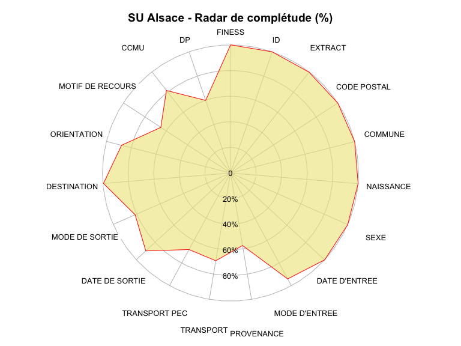
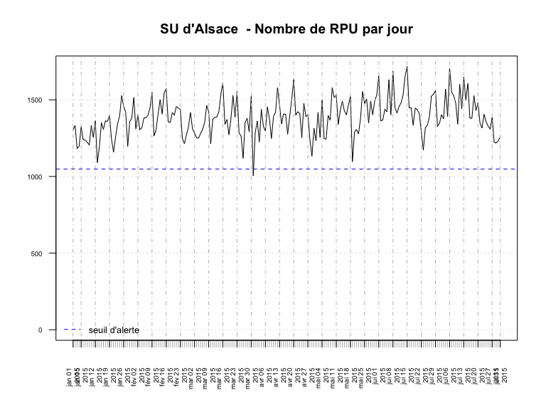
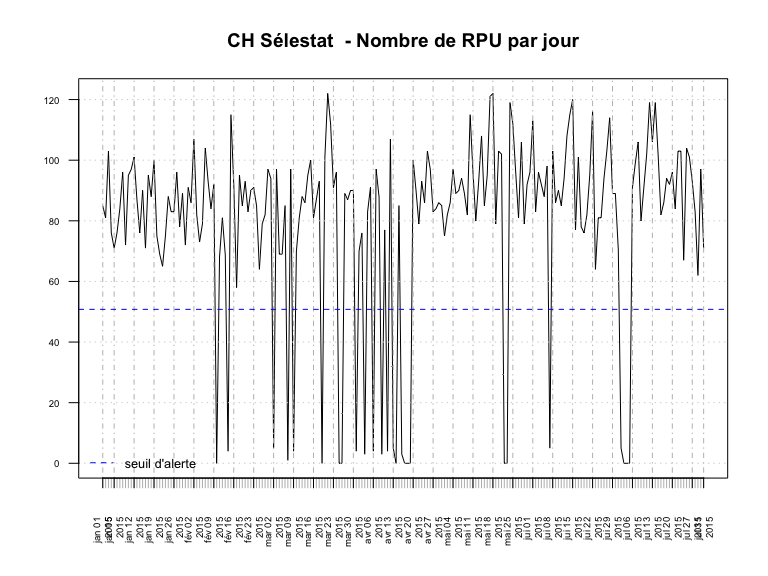
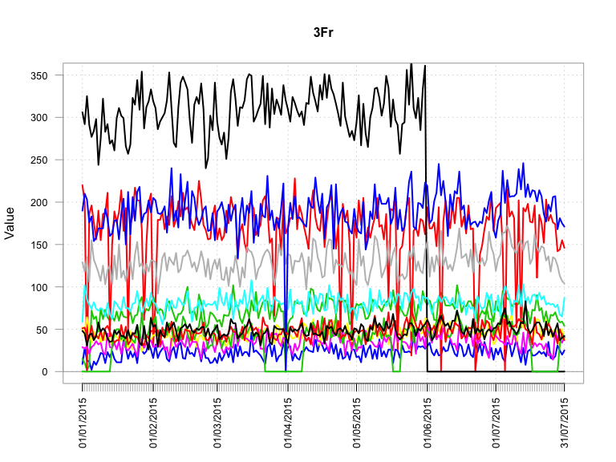
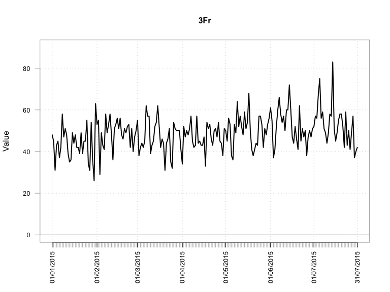

# Chiffres Clés
RESSURAL  
21 août 2015  

Version mise à jour le: __04/09/2015__

Chiffres Clés de la région Alsace en 2014
================================

Date de point: 31/12/2014

Recueil des données
-------------------

  Nombre de passages  |   n     
------------- | -------------:
Nombre de RPU transmis  | 416 733
Evolution 2013/2014  |  82.45 %  |
Moyenne quotidienne de passage  | 1 145
Nombre de passages (SAE)  |  NA
Exhaustivité  |  NA%

Patients
-------------------

|  Caractéristiques  |  n  |
|-----|:-----|
|  sex-ratio  |  1.09  |
|  age moyen  |  38 ans |
|  moins de 1 ans  |  3.69 %  |
|  moins de 15 ans  |  24.82 %  |
|  75 ans et plus  |  13.74 %  |
|  patients hors région  |  4.43 %  |
|  taux de recours régional  |  21.31 %  |

Arrivées
-------------------

|  Passages  |  %  |
|-----|:-----|
|  la nuit (20h-8h)  |  27.7 %  |
|  en soirée (20h-0H)  |  17.31 %  |
|  en horaire de PDS  |  45.22%  |

|  Modes d'arrivée  |  %  |
|-----|:-----|
|  moyens personnels  |  72.16%  |
|  SMUR  |  0.93 %  |
|  VSAV  |  10.35 %  |
|  Ambulances privées  |  15.94 %`  |

|  Gravité  |  %  |
|-----|:-----|
|  CCMU 1  |  15.21 %  |
|  CCMU 2  |  69.24 %  |
|  CCMU 3  |  13.88 %  |
|  CCMU 4 et 5  |  1.28 %  |
|  CCMU P  |  0.38 %  |
|  CCMU D  |  0.01 %  |

Diagnostic Principal
--------------------

|  Recours  |  %  |
|-----|:-----|
|  médico-chirurgical  |  55.22 %  |
|  traumatologique  |  38.42 %  |
|  psychiatrique  |  1.95 %  |
|  toxicologique  |  1.41 %  |
|  autres recours  |  3 %  |

Mode de sortie
-------------------

  Recours  |  -  |  %  |
|-----|:-----|--------|
|  Hospitalisation  |  Mutation  |  22.72 %  |
|                   |  Transfert  |  1.78 %  |
|                   |  dont UHCD  |  43.57 %  |
|  Domicile         |            |  75.5 %  |

Durée
-------------------

### Tous âge

  Durée de passage  |  heures  |
|-----|:-----|
|  moyenne  |  2h40  |
|  médiane  |  1h53  |

  Passages de moins de 4 heures  |  %  |
|-----|:-----|
|  lors d'une hospitalisation  |  9 %  |
|  lors d'un retour à domicile  |  72.37 %  |

### Pour les 75 ans ou plus

  Durée de passage  |  heures  |
|-----|:-----|
|  moyenne  |  4h7  |
|  médiane  |  3h30  |

  Passages de moins de 4 heures  |  %  |
|-----|:-----|
|  lors d'une hospitalisation  |  21.56 %  |
|  lors d'un retour à domicile  |  36.19 %  |

Diagramme de complétude
-----------------------
 

Courbe de production quotidienne de RPU
---------------------------------------

Représentation graphique du nombre de RPU transmis par jour, avec le seuil d'alerte en dessous duquel le nombre de RPU transmis est considéré comme anormal.

  
Représentation avec PerformanceAnalytics

  

