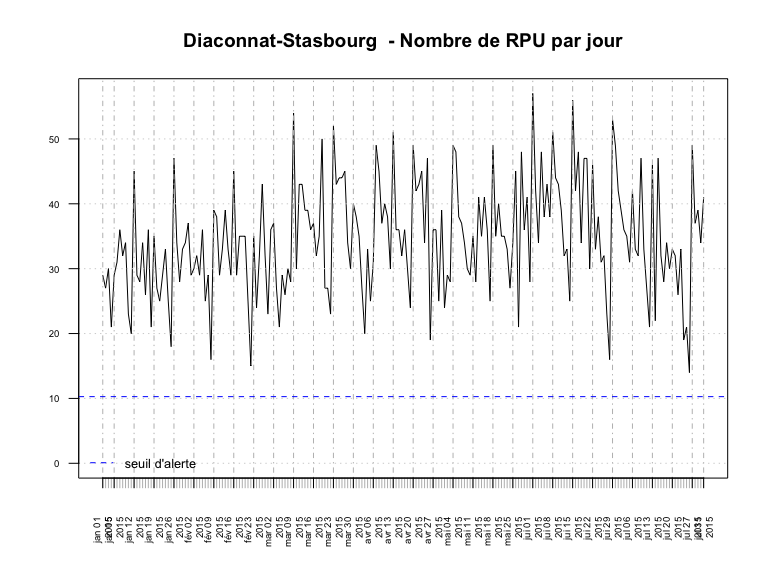

# Chiffres clés - Diaconat-Strasbourg
RESURAL  
27 août 2015  

Version mise à jour le: __03/09/2015__

Chiffres Clés Clinique Diaconnat-Strasbourg en 2015
================================

Date de point: 31/07/2015

Recueil des données
-------------------

  Nombre de passages  |   n     
------------- | -------------:
Nombre de RPU transmis  | 7 320
Evolution 2014/2015  |  7076.47 %  |
Moyenne quotidienne de passage  | 35
Nombre de passages (SAE)  |  NA
Exhaustivité  |  NA%

Patients
-------------------

|  Caractéristiques  |  n  |
|-----|:-----|
|  sex-ratio  |  1.38  |
|  age moyen  |  35.7 ans |
|  moins de 1 ans  |  0.04 %  |
|  moins de 15 ans  |  12.16 %  |
|  75 ans et plus  |  3.96 %  |
|  patients hors région  |  3.93 %  |

<!-- Manque la population du secteur
|  taux de recours régional  |  0.38 %  |
-->

Arrivées
-------------------

|  Passages  |  %  |
|-----|:-----|
|  la nuit (20h-8h)  |  16.33 %  |
|  en soirée (20h-0H)  |  11.9 %  |
|  en horaire de PDS  |  31.28%  |

|  Modes d'arrivée  |  %  |
|-----|:-----|
|  moyens personnels  |  95.38%  |
|  SMUR  |  0.49 %  |
|  VSAV  |  1.85 %  |
|  Ambulances privées  |  2.2 %`  |

|  Gravité  |  %  |
|-----|:-----|
|  CCMU 1  |  100 %  |
|  CCMU 2  |  NA %  |
|  CCMU 3  |  NA %  |
|  CCMU 4 et 5  |  NA %  |
|  CCMU P  |  NA %  |
|  CCMU D  |  NA %  |

Diagnostic Principal
--------------------

|  Recours  |  %  |
|-----|:-----|
|  médico-chirurgical  |  20.73 %  |
|  traumatologique  |  79.27 %  |
|  psychiatrique  |  0 %  |
|  toxicologique  |  0 %  |
|  autres recours  |  0 %  |

Mode de sortie
-------------------

  Recours  |  -  |  %  |
|-----|:-----|--------|
|  Hospitalisation  |  Mutation  |  14.17 %  |
|                   |  Transfert  |  0.05 %  |
|                   |  dont UHCD  |  93.93 %  |
|  Domicile         |            |  85.79 %  |

Durée
-------------------

### Tous âge

  Durée de passage  |  heures  |
|-----|:-----|
|  moyenne  |  1h20  |
|  médiane  |  1h8  |

  Passages de moins de 4 heures  |  %  |
|-----|:-----|
|  lors d'une hospitalisation  |  1.14 %  |
|  lors d'un retour à domicile  |  96.93 %  |

### Pour les 75 ans ou plus

  Durée de passage  |  heures  |
|-----|:-----|
|  moyenne  |  1h19  |
|  médiane  |  1h9  |

  Passages de moins de 4 heures  |  %  |
|-----|:-----|
|  lors d'une hospitalisation  |  6.09 %  |
|  lors d'un retour à domicile  |  92.39 %  |

Diagramme de complétude
-----------------------
 

Courbe de production quotidienne de RPU
=======================================

Représentation graphique du nombre de RPU transmis par jour, avec le seuil d'alerte en dessous duquel le nombre de RPU transmis est considéré comme anormal.

 
