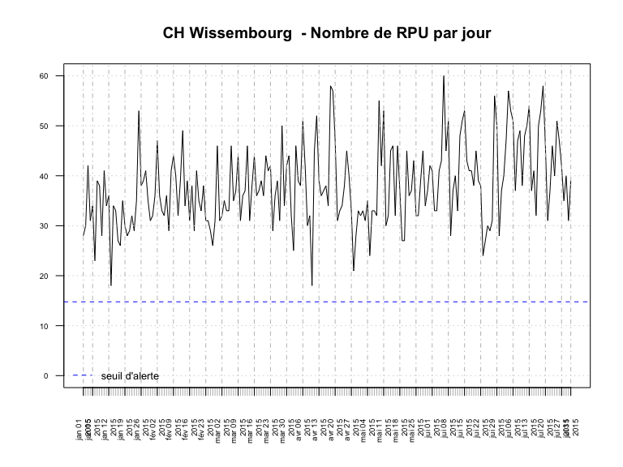

# Chiffres clés - CH Wissembourg
RESURAL  
27 août 2015  

Version mise à jour le: __04/09/2015__

Chiffres Clés du CH WISSEMBOURG en 2014
================================

Date de point: 31/12/2014

Recueil des données
-------------------

  Nombre de passages  |   n     
------------- | -------------:
Nombre de RPU transmis  | 12 158
Evolution 2013/2014  |  60.29 %  |
Moyenne quotidienne de passage  | 33
Nombre de passages (SAE)  |  NA
Exhaustivité  |  NA%

Patients
-------------------

|  Caractéristiques  |  n  |
|-----|:-----|
|  sex-ratio  |  1.08  |
|  age moyen  |  42.5 ans |
|  moins de 1 ans  |  1.25 %  |
|  moins de 15 ans  |  18.88 %  |
|  75 ans et plus  |  17.26 %  |
|  patients hors région  |  3.17 %  |

<!-- Manque la population du secteur
|  taux de recours régional  |  0.63 %  |
-->

Arrivées
-------------------

|  Passages  |  %  |
|-----|:-----|
|  la nuit (20h-8h)  |  23.6 %  |
|  en soirée (20h-0H)  |  14.73 %  |
|  en horaire de PDS  |  43.5%  |

|  Modes d'arrivée  |  %  |
|-----|:-----|
|  moyens personnels  |  76.56%  |
|  SMUR  |  1.81 %  |
|  VSAV  |  9.29 %  |
|  Ambulances privées  |  12.32 %`  |

|  Gravité  |  %  |
|-----|:-----|
|  CCMU 1  |  6.48 %  |
|  CCMU 2  |  85.85 %  |
|  CCMU 3  |  6.15 %  |
|  CCMU 4 et 5  |  1.3 %  |
|  CCMU P  |  0.23 %  |
|  CCMU D  |  NA %  |

Diagnostic Principal
--------------------

|  Recours  |  %  |
|-----|:-----|
|  médico-chirurgical  |  52.65 %  |
|  traumatologique  |  40.42 %  |
|  psychiatrique  |  2.24 %  |
|  toxicologique  |  0.99 %  |
|  autres recours  |  3.7 %  |

Mode de sortie
-------------------

  Recours  |  -  |  %  |
|-----|:-----|--------|
|  Hospitalisation  |  Mutation  |  21.46 %  |
|                   |  Transfert  |  1.65 %  |
|                   |  dont UHCD  |  9.15 %  |
|  Domicile         |            |  76.88 %  |

Durée
-------------------

### Tous âge

  Durée de passage  |  heures  |
|-----|:-----|
|  moyenne  |  1h58  |
|  médiane  |  1h23  |

  Passages de moins de 4 heures  |  %  |
|-----|:-----|
|  lors d'une hospitalisation  |  16.53 %  |
|  lors d'un retour à domicile  |  73.95 %  |

### Pour les 75 ans ou plus

  Durée de passage  |  heures  |
|-----|:-----|
|  moyenne  |  2h57  |
|  médiane  |  2h32  |

  Passages de moins de 4 heures  |  %  |
|-----|:-----|
|  lors d'une hospitalisation  |  45.99 %  |
|  lors d'un retour à domicile  |  33 %  |

Diagramme de complétude
=======================

 

Courbe de production quotidienne de RPU
=======================================

Représentation graphique du nombre de RPU transmis par jour, avec le seuil d'alerte en dessous duquel le nombre de RPU transmis est considéré comme anormal.

 
