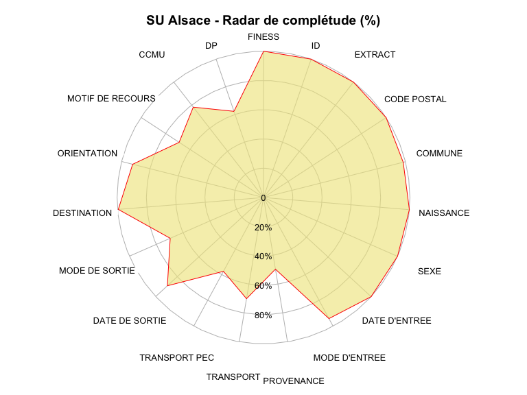
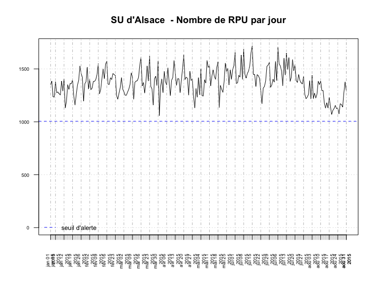
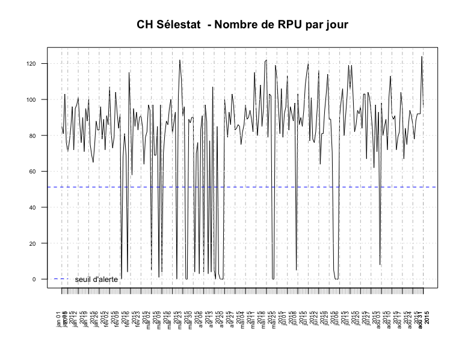
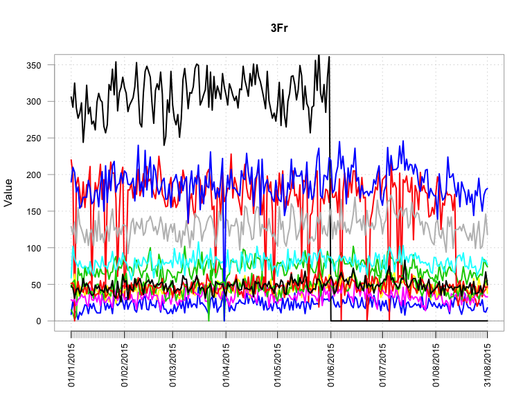
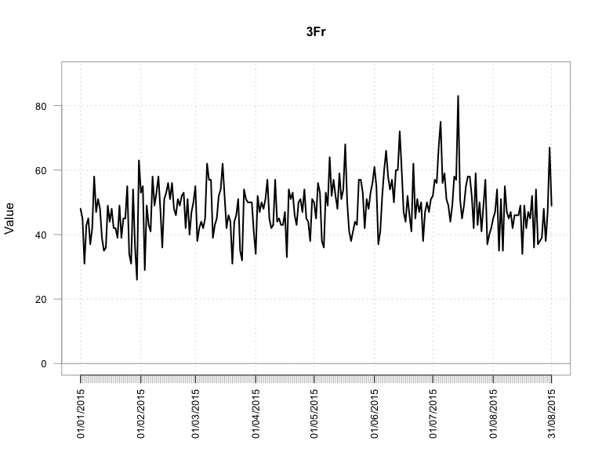

# Chiffres Clés
RESSURAL  
21 août 2015  

Version mise à jour le: __21/09/2015__

Année courante: 2015

Chiffres Clés de la région Alsace en 2015
================================

Date de point: 31/08/2015

Recueil des données
-------------------

  Nombre de passages  |   n     
------------- | -------------:
Nombre de RPU transmis  | 336 698
Evolution 2014/2015  |  47.41 %  |
Moyenne quotidienne de passage  | 1 391
Nombre de passages (SAE)  |  NA
Exhaustivité  |  NA%

Patients
-------------------

|  Caractéristiques  |  n  |
|-----|:-----|
|  sex-ratio  |  1.09  |
|  age moyen  |  36.9 ans |
|  moins de 1 ans  |  3.84 %  |
|  moins de 15 ans  |  26.31 %  |
|  75 ans et plus  |  12.65 %  |
|  patients hors région  |  4.51 %  |
|  taux de recours régional  |  17.2 %  |

Arrivées
-------------------

|  Passages  |  %  |
|-----|:-----|
|  la nuit (20h-8h)  |  27.17 %  |
|  en soirée (20h-0H)  |  16.77 %  |
|  en horaire de PDS  |  44.87%  |

|  Modes d'arrivée  |  %  |
|-----|:-----|
|  moyens personnels  |  71.3%  |
|  SMUR  |  0.99 %  |
|  VSAV  |  9.98 %  |
|  Ambulances privées  |  17.17 %`  |

|  Gravité  |  %  |
|-----|:-----|
|  CCMU 1  |  19.06 %  |
|  CCMU 2  |  66.47 %  |
|  CCMU 3  |  12.93 %  |
|  CCMU 4 et 5  |  1.2 %  |
|  CCMU P  |  0.33 %  |
|  CCMU D  |  0.01 %  |

Diagnostic Principal
--------------------
<<<<<<< HEAD
=======

>>>>>>> 90258c1210a64b6f69094acce45289977d3175b5

Mode de sortie
-------------------

  Recours  |  -  |  %  |
|-----|:-----|--------|
|  Hospitalisation  |  Mutation  |  21.7 %  |
|                   |  Transfert  |  1.53 %  |
|                   |  dont UHCD  |  30.16 %  |
|  Domicile         |            |  76.78 %  |

Durée
-------------------

### Tous âge

  Durée de passage  |  heures  |
|-----|:-----|
|  moyenne  |  3h2  |
|  médiane  |  1h57  |

  Passages de moins de 4 heures  |  %  |
|-----|:-----|
|  lors d'une hospitalisation  |  7.52 %  |
|  lors d'un retour à domicile  |  70.92 %  |

### Pour les 75 ans ou plus

  Durée de passage  |  heures  |
|-----|:-----|
|  moyenne  |  4h18  |
|  médiane  |  3h45  |

  Passages de moins de 4 heures  |  %  |
|-----|:-----|
|  lors d'une hospitalisation  |  17.5 %  |
|  lors d'un retour à domicile  |  35.93 %  |

Diagramme de complétude
-----------------------
 

Courbe de production quotidienne de RPU
---------------------------------------

Représentation graphique du nombre de RPU transmis par jour, avec le seuil d'alerte en dessous duquel le nombre de RPU transmis est considéré comme anormal.

  
Représentation avec PerformanceAnalytics

  

