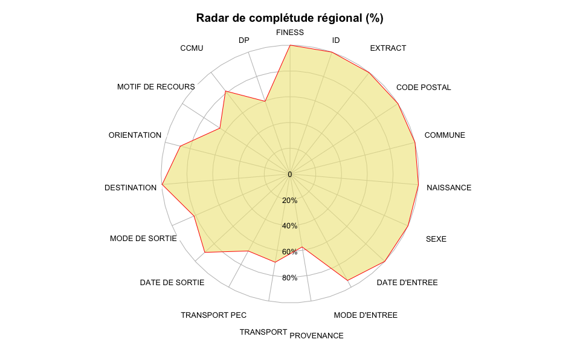

# Diagramme de complétude des RPU
JcB - FEDORU  
13/03/2015 (MAJ le 28/03/2015)  

Radar de complétude
===================

Ce fichier est créé pour illustrer la méthode utilisée pour construire un radar de complétude.
Transmis à Gilles Faugeras pour le rapport FEDORU.

Les rubriques
-------------

La version 6 des RPU arrêtée par l'InVS et reprise par me ministère de la santé comporte 18 rubriques:

"CODE_POSTAL"   "COMMUNE"  "NAISSANCE" "SEXE" "ENTREE" "MODE_ENTREE" "PROVENANCE" "TRANSPORT"     "TRANSPORT_PEC"
"MOTIF" "GRAVITE"  "DP" "LISTE_DA"  "LISTE_ACTES"
"SORTIE" "MODE_SORTIE" "ORIENTATION"  "DESTINATION"

Et éventuellement 2 informations extraites de l'entête du fichier:
"FINESS" et "EXTRACT" (date d'extraction)   
                        
Deux rubriques ne font pas l'objet d'une mesure de la complétude: "LISTE_DA" et "LISTE_ACTES".

Au final il reste 16 items dont on peut calculer la complétude et résumer l'information sur un graphe en étoile. L'exemple est réalisé à partir d'une routine écrite à l'aide du langage [R](). Les données sont stockées dans un tableau rectangulaire de 18 colonnes et 40509 lignes correspondant aux RPU du mois de janvier 2015.

Le mode de sortie des urgences
------------------------------

Le RPU comporte une rubrique factorielle MODE_SORTIE avec quatre issues possibles:

- la MUTATION (hospitalisation dans le même établissement)
- le TRANSFERT (hospitalisation dans un autre établissement)
- le DOMICILE (le patient rentre à son domicile où ce qui en tient lieu)
- le DECES

Pour les patients hospitalisés (MUTATION et TRANSFERT), le mode de sortie peut être affiné par le rubriques DESTINATION et ORIENTATION.
Ces deux rubrique ne peuvent pas être complétée si on a coché DOMICILE ou DECES; elle sont donc laissée vides, ce qui induit une ambiguité lorsqu'on veut établir la complétude des champs DESTINATION et ORIENTATION. Ceci entraine une sous estimation importante du taux de complétude pour ces deux rubriques. Il convient donc pour calculer la complétude de ces champs, d'isoler les RPU correspondant à une hospitalisation.

Les modes de sortie
-------------------


Ordonner les items
------------------
Les items peuvent être rangés en 4 groupes:

#### 3 Données d'identification

- FINESS
- ID
- Extract

#### 4 Données caractéristiques patient:

- Code postal
- Commune
- Date de naissance
- Age: redondant avec la date de naissance. Pas représenté sur le graphe
- Sexe

#### 9 Données administratives:

- Date et heure d'entrée
- Mode d'entrée
- Provenance
- Mode de transport
- PEC durant le transport
- Date et heure de sortie
- Mode de sortie
- Destination
- Orientation

#### 3 Données médicales:

- Motif de recours
- CCMU
- DP

La présentation en radar regroupe les items en 4 classes de façon à standardiser la présentation.
 

Résultat
--------




Routines R
----------

En modifiant _dx_ on peut appliquer la fonction à toutes les données, à un établissement, une sous-population, etc.

```{}
#===============================================
# Taux complétude RPU
#===============================================

# taux de complétude global. 
# Pour chacune des rubriques RPU calcule le taux de réponse (complétude)
#'@author JcB 2013-02-01
#'@keywords complétude
#'@family RPU
#'@param dx dataframe
#'@return vecteur des taux de complétude


completude <- function(dx){
    # complétude brute. Des corrections sont nécessaires pour DESTINATION
    completude <- apply(dx, 2, function(x){round(100 * mean(!is.na(x)),2)})
    # correction pour Destination et Orientation
    # Les items DESTINATION et ORIENTATION ne s'appliquent qu'aux patients hspitalisés. 
    # On appelle hospitalisation les RPU pour lequels la rubrique MODE_SORTIE = MUTATION ou TRANSFERT. 
    # Pour les sorties à domicile, ces rubriques ne peuvent pas être complétées ce qui entraine 
    # une sous estimation importante du taux de complétude pour ces deux rubriques. 
    # On ne retient donc que le sous ensemble des patients hospitalisés pour lesquels les rubriques 
    # DESTINATION et ORIENTATION doivent être renseignées.
    hosp <- dx[dx$MODE_SORTIE %in% c("Mutation","Transfert"), c("DESTINATION", "ORIENTATION")]
    completude.hosp <- apply(hosp, 2, function(x){round(100 * mean(!is.na(x)),2)})
    completude['ORIENTATION'] <- completude.hosp['ORIENTATION']
    completude['DESTINATION'] <- completude.hosp['DESTINATION']
    
    # completude <- completude[-c(1,7)]
    return(sort(completude)) # tableau trié
}

#===============================================
# diagramme en étoile de la complétude
#===============================================

#'@description dessine un graphe en étoile à partir des données retournées par "completude"
#'@author JcB 2013-02-01
#'@keywords spider, diagramme étoile
#'@family RPU
#'@param completude taux de completude global calculé par la fonction completude
#'@return diagramme en étoile
#'@usage radar.completude(completude(dx))

radar.completude <- function(completude){
    library("openintro")
    library("plotrix")
    par(cex.axis = 0.8, cex.lab = 0.8, oma=c(0,0,0,0)) # taille des caractères
    # diagramme en étoile
    radial.plot(completude, rp.type="p", 
    radial.lim=c(0,100), 
    radial.labels=c("0","20%","40%","60%","80%",""),
    poly.col = fadeColor("khaki",fade = "A0"),  # line.col="khaki",
    start = 1.57, 
    clockwise = TRUE, 
    line.col = "red", 
    labels = names(completude), 
    cex.axis = 0.6,
    label.prop = 1.25, 
    show.grid.labels = 1, # N = 4
   
    )
    par(cex.axis = 1, cex.lab = 1)
}

```

Références
----------

R Core Team (2014). R: A language and environment for statistical computing. R Foundation for Statistical Computing, Vienna,
  Austria. URL http://www.R-project.org/.

 Lemon, J. (2006) Plotrix: a package in the red light district of R. R-News, 6(4): 8-12.
