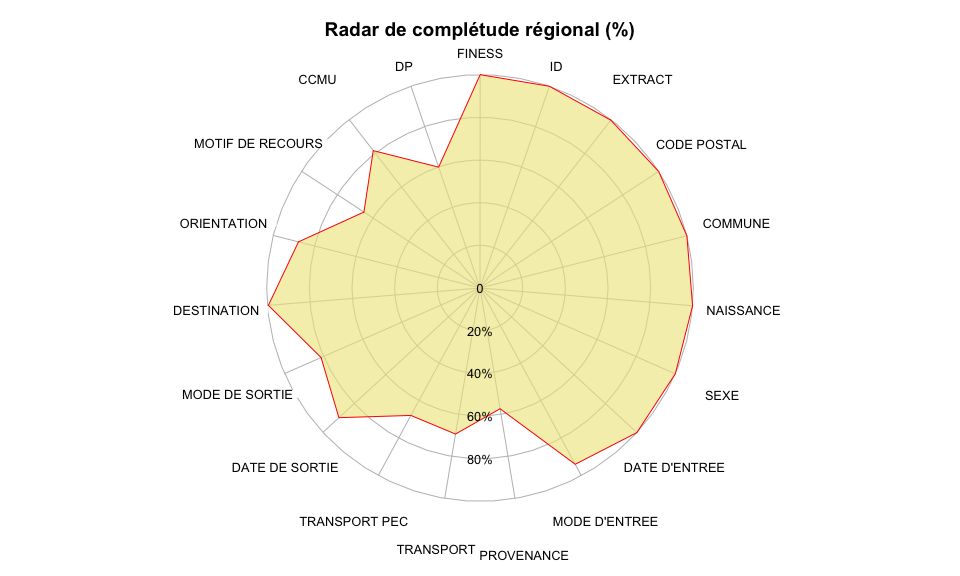
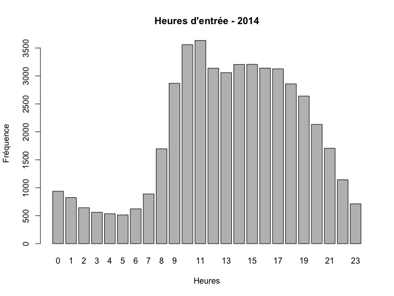

# Activité des structures d’urgences : panorama 2014 de la région ALSACE
RESURAL (JcB)  
28/01/2015  


Activité des structures d’urgences : panorama 2014 de la région ALSACE
=========================================================================
Rapport 2014 respectant les préconisations de la FEDORU. Source:
[Trame commune](https://docs.google.com/document/d/101LYVqVLeHZnrujfMm3aqBYfbOwx3CPEB3Y-Lbud2Ls/edit)

Le document de référence pour le rapport est: __V4 trame commune 2014 rapport inter région__ (xps: /home/jcb/Documents/Resural/FEDORU/Trame_Commune/DOC/Trame commune 2014 rapport inter région (V4).docx)

__NOTE__: certaines informations utiles sont dans __RPU_Doc__.

LE MOT DU PRÉSIDENT DE LA FEDORU
================================


La publication du panorama des urgences de la région __ALSACE__constitue une excellente occasion pour présenter la fédération des observatoires régionaux des urgences (FEDORU) qui compte __RESURAL__ parmi ses membres actifs.

La FEDORU a été créée au mois d'octobre 2013. Ses membres sont chargés dans leur région respective du traitement des données d'urgences ; ce point commun est le trait d'origine de la FEDORU et donne son empreinte à l'objet de notre association que je cite ici :

- promouvoir les observatoires régionaux des urgences et les structures ayant une activité similaire ;
- promouvoir toutes les actions visant à améliorer la connaissance sur les soins de premier recours ;
- partager les expertises dans le domaine du recueil, de l’analyse et de l’évaluation de la qualité des données relatives à l’activité des urgences.

Les premières publications de la FEDORU (disponibles sur le site : http://www.fedoru.fr) abordent les thèmes techniques suivants :

- Recommandations pour la création d’un ORU
- Collecte et usage des RPU
- Hôpital en tension - Synthèse FEDORU

Ces documents constituent le socle indispensable à la conduite de travaux inter-régionaux. Nous pourrons ainsi comparer nos résultats, harmoniser les indicateurs retenus dans nos publications respectives, travailler sur des échantillons de données plus importants(inter-région ou national), mais aussi évaluer l'impact de différentes organisations.

La recherche de consensus et d’échanges entre les différents acteurs régionaux représentés au sein de la FEDORU s’illustre parfaitement dans cette publication qui prend le parti de respecter les premières recommandations sur le traitement des RPU. Le “panorama des urgences en région ….”, intègre le format d’analyse commun 2015 proposé de manière collégiale par nos groupes experts et validé par notre conseil d’administration. Ce socle d’analyse produit par “la structure concernée” sera rapproché des résultats des autres régions et donnera lieu à une publication commune au cours de l’année 2015.
J’adresse au nom de la FEDORU toutes mes félicitations à l’ensemble de l’équipe de __RESURAL__ pour la qualité de leurs travaux mais aussi et surtout à tous les professionnels des services d’urgences de l'__ALSACE__ pour le fastidieux mais si précieux travail de collecte sur le terrain.

__Dr G. VIUDES__

_Président de la FEDORU_

Description de l’offre de soins
===============================

Qualité des données 
-------------------
Réalisation d’un diagramme radar présentant l’exhaustivité des items RPU.

  

Les chiffres clés de l’activité des services d’urgences
=======================================================

Recueil des données
-------------------


- Nombre de passages dans l'année [C]: 416 733 RPU
- Moyenne quotidienne de passages [C]: 1 142 RPU
- %(N) d'évolution par rapport à année N-1 [C]: 122 %.
- % d’évolution moyenne sur les 5 dernières années (méthode calcul : moyenne des évolutions constatées entre chaque année)
- Données renseignées (données à partir desquelles tout le reste de l’analyse sera effectuée)
    - Nombre de RPU transmis: 416 733 RPU
    - Exhaustivité du recueil : Nb RPU transmis / Nb de passages déclarés 84 % (NOTE le nombre de passages déclarés est celui indiqué par les données SAE 2013)

PATIENTS
--------
### SEXE


- %(N) Femme [C]: 47.78 % (199 110)
- %(N) Homme [C]: 52.22 % (217 617)
- Sex ratio: 1.09
- Taux de masculinité: 0.52

### Age


- age moyen[C]: 38.03 ans.
- age moyen des hommes [S]: 35.93 ans.
- age moyen des femmes [S]: 40.31 ans.

- % (N) < 1 an [C]: 15376 (3.69 %)
- %(N) < 15 ans [C]: 103413 (24.82 %)
- %(N) < 18 ans [C]: 119213 (28.61 %)
- %(N) >= 75 ans [C]: 57271 (13.74 %)
- Pyramide des ages:

 

```
## [1] 5.1 4.1 4.1 2.1
```

### Taux de recours (définition FEDORU) régional aux urgences. [S]
Utilisation des données INSEE qui collent le plus à la période d’étude (projections ou données consolidées)

TARRU: __21.31%__ (ref: population alsacienne 2014)

### %  de patients ne venant pas de la région (étranger compris)

4.43%

ARRIVÉE
-------
### Horaires de passage
 

- % passages nuit [C]: 24.74 % (N = 92610)
- % passages nuit profonde [C]: 11.09 % (N = 41500)
- %  passages en horaire de PDS

### Moyens d'arrivée


- __%(N) d'arrivée personnel__ [S]: 72.16 % (N = 208 771)
- __%(N) d'arrivée SMUR__ [S]: 0.93 % (N = 2 702)
- __%(N) d'arrivée VSAB__ [S]: 10.35 % (N = 29 954)
- __%(N) d'arrivée Ambulance__ [S]: 15.94 % (N = 46 112)

NB : commentaire possible pour expliquer que la somme des 4 pourcentages ci dessus ne fait pas 100 %

### Gravité (CCMU)


- __%(N) CCMU 1 et 2__ [C]: 84.45% (n = 286979)
- __%(N) CCMU 4 et 5__ [C]: 1.28% (n = 4341)

DIAGNOSTIC PRINCIPAL 

%  Médico-chirurgical 
%  Traumatologique
%  Psychiatrique
%  Toxicologique
%  Autres recours

### Durées de passage


- durée moyenne de passage 155 mn.
- écart-type: 171.59 mn.
- médiane: 109 mn.
- nombre de passages > 4 heures: 69521 (18.69 %).
- nombre de passages inférieurs ou égaux à 4 heures: 302546 (81.31 %).

- Lors d’une hospitalisation post-urgences (hospitalisation = mutation + transfert)
- Lors d’un retour au domicile

### MODE DE SORTIE


- % (N) de retour à domicile: 75.5 % (N = 255 852)
- % (N) Hospitalisation: 24.5 % (N = 83 024)
- % (N) Mutation: 22.72 % (N = 76 999)
- % (N) Transfert: 1.78 % (N = 6 025)


Les chiffres clés de l’activité des SAMU
========================================
 (à partir des données SRVA "officielles")

- Nombre de dossiers de régulation médicale (DRM)
- Nombre de SMUR :
    - dont primaires
- Nombre d’ambulances privées à la demande du SAMU

Les chiffres clés de l’activité pédiatrique des services d’urgences (moins de 18 ans)
=====================================================================================


```
## ped
##      <28j  28j-1an[   1-5ans[  5-10ans[ 10-15ans[ 15-18ans[ 
##      1791     13554     36287     24738     27012     15800
```

 
RECUEIL DES DONNÉES
-------------------
- Nombre de passages dans l'année: 119213
- Moyenne quotidienne de passage: 326.61 passages/j
- Taux d'urgences pédiatriques (Nb RPU Pédia/ Nb RPU global)*100: 28.61 %
- TODO: % d'évolution par rapport à l'année N-1(données SAE pour ceux qui n’ont pas d’historique RPU fiable et permettant la comparaison, préciser l’origine des données)

PATIENTS
--------


- Sex ratio: 1.22
- Pyramide des âges (âge par année, borne supérieure toujours exclue)
- Par sous classes d’âge:


Les chiffres clés de l’activité gériatrique des services d’urgences (plus de 75 ans)
====================================================================================

RECUEIL DES DONNÉES
-------------------
- Nombre de passages dans l'année: 54310
- Moyenne quotidienne de passage: 148.79 passages/j
- Taux d'urgences gériatriques (Nb RPU Géria/ Nb RPU global)*100: 13.03 %
- TODO: % d'évolution par rapport à l'année N-1(données SAE pour ceux qui n’ont pas d’historique RPU fiable et permettant la comparaison, préciser l’origine des données)

PATIENTS
--------
 

```
               effectif moyenne par jour  médiane par jour sex ratio
75-84 ans         30438                83               83      0.80
85 ans et plus    23872                65               66      0.47
```
- Sex ratio: 0.64
- Pyramide des âges (âge par année, borne supérieure toujours exclue)
- Par sous classes d’âge:

                  effectif   moyenne par jour    médiane par jour   sex ratio
---------------  ---------  ------------------  -----------------  ----------
75-84 ans            30438                  83                 83        0.80
85 ans et plus       23872                  65                 66        0.47

ARRIVÉE
-------

### Horaires de passage


- %  passages la nuit: 22.35 % (N = 12140)
- %  passages en horaire de PDS: 38.09 % (N = 20688)

### Moyens de transport


- %  d’arrivées Moyen perso: 20.17 % (N = 10953)
- %  d'arrivées SMUR: 1.2 % (N = 654)
- %  d'arrivées VSAV: 11.98 % (N = 6505)
- %  d'arrivées ambulance privée: 37.91 % (N = 20587)
- % réponses manquantes: 

NB : commentaire possible pour expliquer que la somme des 4 pourcentages ci dessus ne fait pas 100 % 

### Gravité


- %  CCMU 1: 4.27 % (N = 2318)
- %  CCMU 4 et 5: 3.16 % (N = 1718)

### Diagnostic principal

- % Médico-chirurgical, dont :
    - % cardio vasculaire
    - % neuro
    - % digestif
    - % respiratoire
- %  Traumatologique
- %  Psychiatrique
- %  Toxicologique
- %  Autres recours

### DURÉE


```
##        NA  Mutation Transfert  Domicile     Décès           
##        NA       219       318       216        NA        NA
```

```
##        NA  Mutation Transfert  Domicile     Décès           
##        NA       200       250       176        NA        NA
```

```
## 
## 	Welch Two Sample t-test
## 
## data:  passages75$duree by passages75$DEVENIR
## t = -4.1, df = 38419, p-value = 0.00003634
## alternative hypothesis: true difference in means is not equal to 0
## 95 percent confidence interval:
##  -11.7  -4.2
## sample estimates:
## mean in group Domicile     mean in group Hosp 
##                    216                    224
```

```
## [1] 0.000036
```

 

- Durée moyenne de passage (HORS UHCD) : 221 minutes
- Durée médiane de passage (HORS UHCD) : 191 minutes
- %  de passages de moins de 4h : 60.92 %
- lors d’une hospitalisation post-urgences (hospitalisation = mutation + transfert): 224.04 minutes.
- lors d’un retour au domicile: 216.09 minutes.

### MODE DE SORTIE

 

```
## pop75$MODE_SORTIE : 
##           Frequency   %(NA+)   %(NA-)
## Mutation      26032     47.9     58.6
## Domicile      16945     31.2     38.2
## NA's           9896     18.2      0.0
## Transfert      1437      2.6      3.2
## NA                0      0.0      0.0
## Décès             0      0.0      0.0
##                   0      0.0      0.0
##   Total       54310    100.0    100.0
```

- %  d’hospitalisation: 50.58 % (N = 27469)
    - % de mutation:47.93 % (N = 26032)
    - % de transfert:2.65 % (N = 1437)
- %  de retour à domicile:31.2 % (N = 16945)

Les chiffres clés de l’activité AVC des services d’urgences
===========================================================

- Nombre de passages AVC urgences, année N
- Nombre de passages AVC urgences, déclinaison par département, établissement, année N
- Moyenne quotidienne, année N
- Age moyen, année N
- Répartition par classe âge en pourcentage, année N
- Répartition par sexe en pourcentage, année N
- TOP 5 pourcentage par code CIM 10, année N
- Répartition we/semaine en pourcentage, année N
- Répartition par tranche heure en pourcentage, année N
- Répartition par orientation en pourcentage, année N
- Temps de passage médian, année N

ANNEXES
=======

ANNEXE 1 : Définitions
----------------------

ANNEXE 2 : Diagramme de complétude des RPU
------------------------------------------

ANNEXE 3 : Calcul du TARRU
--------------------------
