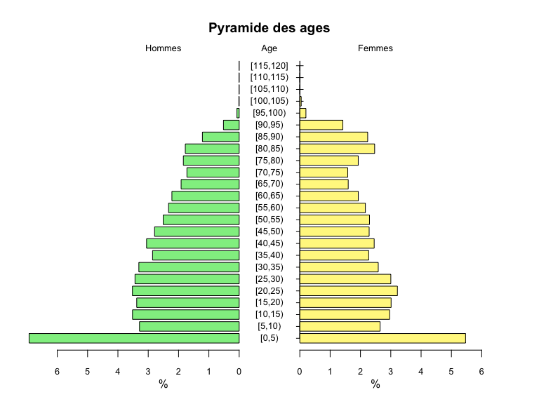
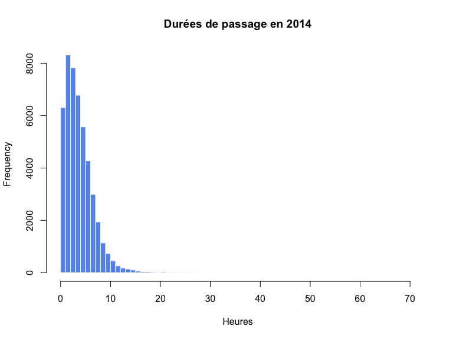
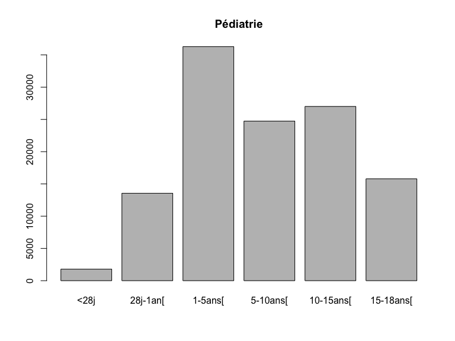
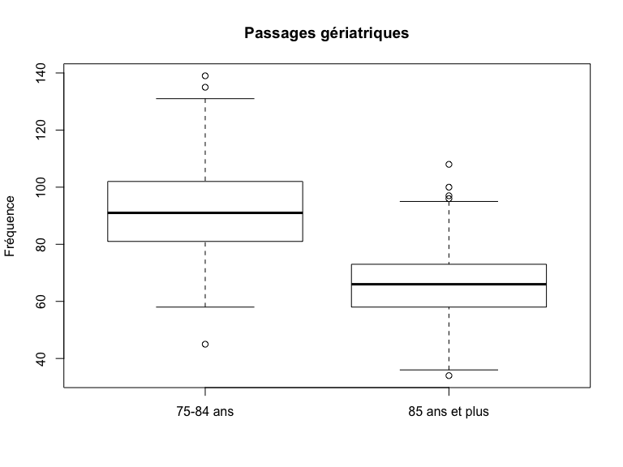
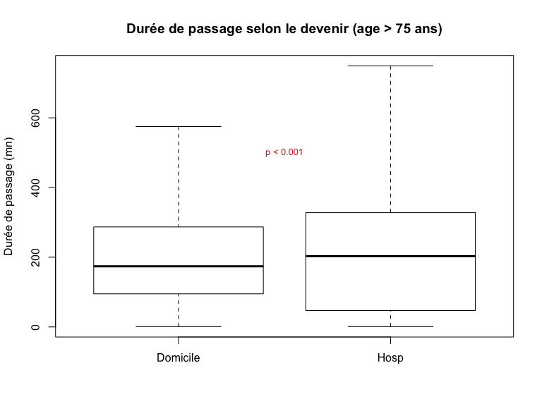
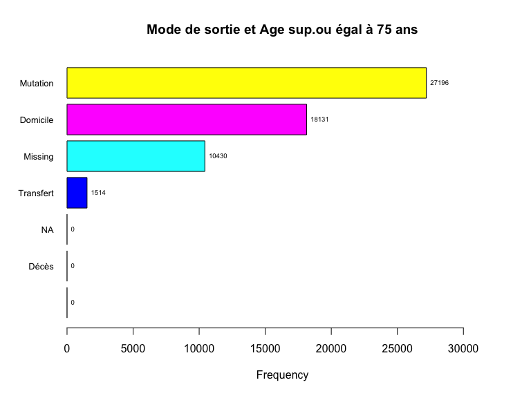
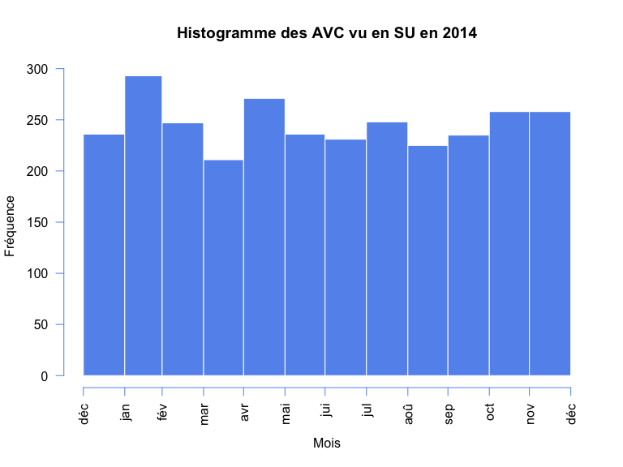
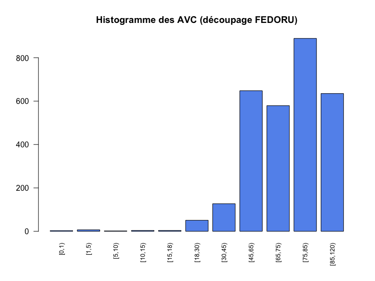
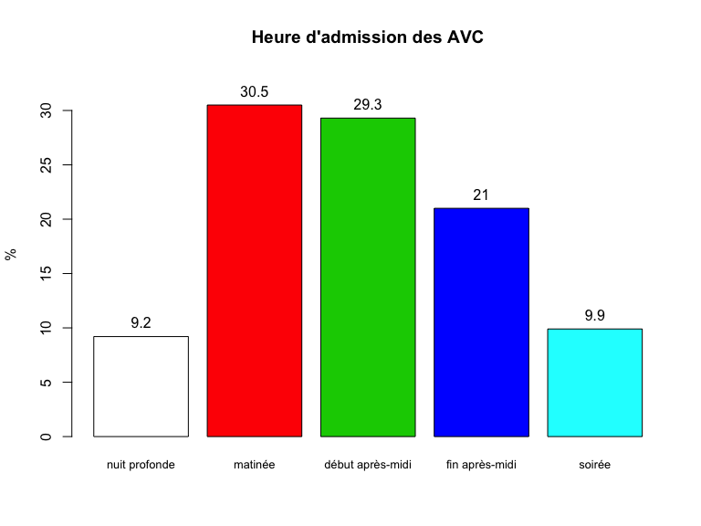

# Activité des structures d’urgences : panorama 2014 de la région ALSACE
RESURAL (JcB)  
28/01/2015  

Version mse à jour le: __Tue Aug 11 15:20:47 2015__

Ajout de la dernière version de Gilles 

- nombre de passages pour 10.000 hab.
- nombre de SU pour 10.000 hab.
- nombre de lignes SMUR financées par une MIG
- nombre de siège de SMUR dont SMUR saisonnier dont antenne SMUR dont hélismur
- séparer privés lucratifs et ESPIC
- nombre de logicels et nombre de SU par région
- SAE 2014 ?
- augmentation par rapport année N-1 en tenant compte uniquement des établissements "stables"
- séparer chu et non chu, samu de chu et de non chu
- retour attendu pour le 4/9


Activité des structures d’urgences : panorama 2014 de la région ALSACE
=========================================================================
Rapport 2014 respectant les préconisations de la FEDORU. Source:
[Trame commune](https://docs.google.com/document/d/101LYVqVLeHZnrujfMm3aqBYfbOwx3CPEB3Y-Lbud2Ls/edit)

Le document de référence pour le rapport est: __V4 trame commune 2014 rapport inter région__ (xps: /home/jcb/Documents/Resural/FEDORU/Trame_Commune/DOC/Trame commune 2014 rapport inter région (V4).docx)

__NOTE__: certaines informations utiles sont dans __RPU_Doc__.

LE MOT DU PRÉSIDENT DE LA FEDORU
================================


La publication du panorama des urgences de la région __ALSACE__constitue une excellente occasion pour présenter la fédération des observatoires régionaux des urgences (FEDORU) qui compte __RESURAL__ parmi ses membres actifs.

La FEDORU a été créée au mois d'octobre 2013. Ses membres sont chargés dans leur région respective du traitement des données d'urgences ; ce point commun est le trait d'origine de la FEDORU et donne son empreinte à l'objet de notre association que je cite ici :

- promouvoir les observatoires régionaux des urgences et les structures ayant une activité similaire ;
- promouvoir toutes les actions visant à améliorer la connaissance sur les soins de premier recours ;
- partager les expertises dans le domaine du recueil, de l’analyse et de l’évaluation de la qualité des données relatives à l’activité des urgences.

Les premières publications de la FEDORU (disponibles sur le site : http://www.fedoru.fr) abordent les thèmes techniques suivants :

- Recommandations pour la création d’un ORU
- Collecte et usage des RPU
- Hôpital en tension - Synthèse FEDORU

Ces documents constituent le socle indispensable à la conduite de travaux inter-régionaux. Nous pourrons ainsi comparer nos résultats, harmoniser les indicateurs retenus dans nos publications respectives, travailler sur des échantillons de données plus importants(inter-région ou national), mais aussi évaluer l'impact de différentes organisations.

La recherche de consensus et d’échanges entre les différents acteurs régionaux représentés au sein de la FEDORU s’illustre parfaitement dans cette publication qui prend le parti de respecter les premières recommandations sur le traitement des RPU. Le “panorama des urgences en région ….”, intègre le format d’analyse commun 2015 proposé de manière collégiale par nos groupes experts et validé par notre conseil d’administration. Ce socle d’analyse produit par “la structure concernée” sera rapproché des résultats des autres régions et donnera lieu à une publication commune au cours de l’année 2015.
J’adresse au nom de la FEDORU toutes mes félicitations à l’ensemble de l’équipe de __RESURAL__ pour la qualité de leurs travaux mais aussi et surtout à tous les professionnels des services d’urgences de l'__ALSACE__ pour le fastidieux mais si précieux travail de collecte sur le terrain.

__Dr G. VIUDES__

_Président de la FEDORU_

Description de l’offre de soins
===============================

Qualité des données 
-------------------
Réalisation d’un diagramme radar présentant l’exhaustivité des items RPU.

  

Complétude en valeur absolue et en pourcentages:`

```
##           FINESS               ID          EXTRACT      CODE POSTAL 
##           416733           416733           415731           416733 
##          COMMUNE        NAISSANCE             SEXE    DATE D'ENTREE 
##           416716           416733           416733           416733 
##    MODE D'ENTREE       PROVENANCE        TRANSPORT    TRANSPORT PEC 
##           391370           239122           289308           283189 
##   DATE DE SORTIE   MODE DE SORTIE      DESTINATION      ORIENTATION 
##           374349           338878            82635            72898 
## MOTIF DE RECOURS             CCMU               DP 
##           270962           339827           245974
```

```
##           FINESS               ID          EXTRACT      CODE POSTAL 
##              100              100              100              100 
##          COMMUNE        NAISSANCE             SEXE    DATE D'ENTREE 
##              100              100              100              100 
##    MODE D'ENTREE       PROVENANCE        TRANSPORT    TRANSPORT PEC 
##               94               57               69               68 
##   DATE DE SORTIE   MODE DE SORTIE      DESTINATION      ORIENTATION 
##               90               81              100               88 
## MOTIF DE RECOURS             CCMU               DP 
##               65               82               60
```

Les chiffres clés de l’activité des services d’urgences
=======================================================

Recueil des données
-------------------


- Nombre de passages dans l'année [C]: 416 733 RPU
- Moyenne quotidienne de passages [C]: 1 142 RPU
- %(N) d'évolution par rapport à année N-1 [C]: 122 %.
- % d’évolution moyenne sur les 5 dernières années (méthode calcul : moyenne des évolutions constatées entre chaque année)
- Données renseignées (données à partir desquelles tout le reste de l’analyse sera effectuée)
    - Nombre de RPU transmis: 416 733 RPU
    - Exhaustivité du recueil : Nb RPU transmis / Nb de passages déclarés 84 % (NOTE le nombre de passages déclarés est celui indiqué par les données SAE 2013)

PATIENTS
--------
### Sexe


- %(N) Femme [C]: 47.78 % (199 110)
- %(N) Homme [C]: 52.22 % (217 617)
- Sex ratio: 1.09
- Taux de masculinité: 0.52

### Age


- age moyen[C]: 38.03 ans.
- age moyen des hommes [S]: 35.93 ans.
- age moyen des femmes [S]: 40.31 ans.

- % (N) < 1 an [C]: 15 376 (3.69 %)
- %(N) < 15 ans [C]: 103 413 (24.82 %)
- %(N) < 18 ans [C]: 119 213 (28.61 %)
- %(N) >= 75 ans [C]: 57 271 (13.74 %)
- Pyramide des ages:

 

```
## [1] 5.1 4.1 4.1 2.1
```

### Taux de recours (définition FEDORU) régional aux urgences. [S]
Utilisation des données INSEE qui collent le plus à la période d’étude (projections ou données consolidées)


TARRU: __21.31%__ (ref: population alsacienne 2014)

### %  de patients ne venant pas de la région (étranger compris)


4.43% (N = `r n.rpu - n.org_als)

ARRIVÉE
-------


### Horaires de passage
 

- % passages nuit [C]: 24.74 % (N = 92 610)
- % passages nuit profonde [C]: 11.09 % (N = 41 500)


- %  passages en horaire de PDS: 45.22 % [N = 188454](Remarque: ne tient pas compte des jours fériés survenant en semaine)

### Variations saisonnières

Variation du nombre de RPU entre les mois d'été (juillet-août) et les autres mois de l'année: -5.82 %

### Moyens d'arrivée


- __%(N) d'arrivée personnel__ [S]: 72.16 % (N = 208 771)
- __%(N) d'arrivée SMUR__ [S]: 0.93 % (N = 2 702)
- __%(N) d'arrivée VSAB__ [S]: 10.35 % (N = 29 954)
- __%(N) d'arrivée Ambulance__ [S]: 15.94 % (N = 46 112)

NB : commentaire possible pour expliquer que la somme des 4 pourcentages ci dessus ne fait pas 100 %

### Gravité (CCMU)


- nombre de CCMU renseignés: 339827
- __%(N) CCMU 1 __ [C]: 15.21% (n = 51 682)
- __%(N) CCMU 1 et 2__ [C]: 84.45% (n = 286 979)
- __%(N) CCMU 4 et 5__ [C]: 1.28% (n = 4 341)

Exhaustivité CCMU :
- Nombre de RPU 2014 hors orientation = FUGUE, PSA et REO ayant un élément transmis pour la CCMU: 335889

DIAGNOSTIC PRINCIPAL 

Remarque: les chiffres sont dans le document _Codes_regroupement_ORUMIP_ => à rajouter.

- %  Médico-chirurgical 
- %  Traumatologique
- %  Psychiatrique
- %  Toxicologique
- %  Autres recours

### Durées de passage

 

- Nb de RPU dont la durée de passage est comprise entre 0 et 72h: 333397
- durée moyenne de passage 156 mn.
- écart-type: 176.18 mn.
- médiane: 110 mn.
- nombre de passages > 4 heures: 62 888 (18.86 %).
- nombre de passages inférieurs ou égaux à 4 heures: 270 509 (81.14 %).

- Lors d’une hospitalisation post-urgences (hospitalisation = mutation + transfert)
    - médiane durée de passage en cas de retour à domicile: __104 minutes__.
    - médiane durée de passage en cas d’hospitalisation: __148 minutes__.
- Lors d’un retour au domicile
    - moyenne durée de passage en cas de retour à domicile: __145.87 minutes__.
    - moyenne durée de passage en cas d’hospitalisation: __187.55 minutes__.

(source: temps de passages.Rmd)

### MODE DE SORTIE


- % (N) de retour à domicile: 75.5 % (N = 255 852)
- % (N) Hospitalisation: 24.5 % (N = 83 024)
- % (N) Mutation: 22.72 % (N = 76 999)
- % (N) Transfert: 1.78 % (N = 6 025)
- Nb de RPU 2014  avec mode de sortie = 6 ou 7 (hospitalisation) avec un élément transmis pour la destination: 82635
- Nb de RPU 2014 avec mode de sortie = 6 ou 7 avec un élement transmis pour l'orientation: 72898


Les chiffres clés de l’activité des SAMU
========================================
 (à partir des données SRVA "officielles")
 


- Nombre de dossiers de régulation médicale (DRM): 480303
- Nombre de SMUR : 25 321
    - dont primaires: format.n(19714)
- Nombre d’ambulances privées à la demande du SAMU: format.n(46031)

Les chiffres clés de l’activité pédiatrique des services d’urgences (moins de 18 ans)
=====================================================================================


```
## ped
##      <28j  28j-1an[   1-5ans[  5-10ans[ 10-15ans[ 15-18ans[ 
##      1791     13554     36287     24738     27012     15800
```

 

RECUEIL DES DONNÉES
-------------------
- Nombre de passages dans l'année: 119 213
- Moyenne quotidienne de passage: 327 passages/j
- Taux d'urgences pédiatriques [(Nb RPU Pédia/ Nb RPU global)x100]: 29 %
- TODO: % d'évolution par rapport à l'année N-1(données SAE pour ceux qui n’ont pas d’historique RPU fiable et permettant la comparaison, préciser l’origine des données)

PATIENTS
--------

```
 AMBU    FO  HELI PERSO  SMUR  VSAB        NA's 
 2024    81    17 71809   706  3053     0 41523 
```

```
[1] 77690
```

```
[1] 94706
```

```
    1     2     3     4     5     D     P        NA's 
24353 63361  6678   211    23     2    78     0 24507 
```
- nombre de garçons: 65619
- nombre de filles: 53590
- Sex ratio: 1.22
- Pyramide des âges (âge par année, borne supérieure toujours exclue)
- Par sous classes d’âge:


### horaires de passages pédiatriques

- nombre de passages la nuit: 32677 (p = 27.41 %)
- nombre de passages en nuit profonde: 8660 (p = 7.26 %)

### Durée de passage


- Nombre de RPU avec une heure de sortie conforme (]0-72h[: 95936
- Durée moyenne de passage (en min): 121.3 mn
- Durée médiane de passage (en min): 86 mn
- Nombre de RPU dont la durée de passage est inférieure à 4h: 89071
- Nombre de RPU avec une heure de sortie conforme (]0-72h[ lors d'une hospitalisation post-urgences: 12452
- Nombre de RPU avec une heure de sortie conforme (]0-72h[ lors d'un retour au domicile: 83483
- Nombre de RPU dont la durée de passage est inférieure à 4h lors d'une hospitalisation post-urgences: 11313
- Nombre de RPU dont la durée de passage est inférieure à 4h lors d'un retour au domicile: 77757

- Nombre de RPU avec un mode de sortie renseigné: 96860
- Nombre de mutation interne: 11996
- Nombre de transfert externe: 556
- nombre de retours à domicile: 84307

Les chiffres clés de l’activité gériatrique des services d’urgences (75 ans et plus)
====================================================================================

RECUEIL DES DONNÉES
-------------------
- Nombre de passages dans l'année: 57 271
- Moyenne quotidienne de passage: 157 passages/j
- Taux d'urgences gériatriques [(Nb RPU Géria/ Nb RPU global)x100]: 13.74 %
- TODO: % d'évolution par rapport à l'année N-1(données SAE pour ceux qui n’ont pas d’historique RPU fiable et permettant la comparaison, préciser l’origine des données)

PATIENTS
--------
 

```
               effectif moyenne par jour  médiane par jour sex ratio
75-84 ans         33399                92               91      0.82
85 ans et plus    23872                65               66      0.47
```
- Nombre d'hommes: 22 665
- Nombre de femmes: 34 605
- Sex ratio: 0.65
- Pyramide des âges (âge par année, borne supérieure toujours exclue)
- Par sous classes d’âge:

                  effectif   moyenne par jour    médiane par jour   sex ratio
---------------  ---------  ------------------  -----------------  ----------
75-84 ans            33399                  92                 91        0.82
85 ans et plus       23872                  65                 66        0.47

ARRIVÉE
-------

### Horaires de passage


- Nb de RPU avec date/heure d'entrée renseignés: 57 271
- %  passages la nuit: 22.38 % (N = 12 815)
- %  passages en horaire de PDS: 36.77 % (N = 21 058)

### Moyens de transport


- nombre de moyens de transport: 57271
- nombre de moyens de transport renseignés: 40878
- nombre de moyens personnels: 11962
- nombre de SMUR: 698
- nombre de VSAV: 6797
- nombre d'ambulances privées: 21370

- %  d’arrivées Moyen perso: 20.89 % (N = 11 962)
- %  d'arrivées SMUR: 1.22 % (N = 698)
- %  d'arrivées VSAV: 11.87 % (N = 6 797)
- %  d'arrivées ambulance privée: 37.31 % (N = 21 370)
- % réponses manquantes: 

NB : commentaire possible pour expliquer que la somme des 4 pourcentages ci dessus ne fait pas 100 % 

### Gravité


- Nombre de RPU avec une CCMU renseignée: 47408
- %  CCMU 1: 4.32 % (N = 2 472)
- %  CCMU 4 et 5: 3.14 % (N = 1 797)

### Diagnostic principal

- % Médico-chirurgical, dont :
    - % cardio vasculaire
    - % neuro
    - % digestif
    - % respiratoire
- %  Traumatologique
- %  Psychiatrique
- %  Toxicologique
- %  Autres recours

### DURÉE


```
##        NA  Mutation Transfert  Domicile     Décès           
##        NA       219       316       215        NA        NA
```

```
##        NA  Mutation Transfert  Domicile     Décès           
##        NA       200       248       174        NA        NA
```

```
## 
## 	Welch Two Sample t-test
## 
## data:  passages75$duree by passages75$DEVENIR
## t = -4.8, df = 41184, p-value = 0.000001585
## alternative hypothesis: true difference in means is not equal to 0
## 95 percent confidence interval:
##  -12.7  -5.3
## sample estimates:
## mean in group Domicile     mean in group Hosp 
##                    215                    224
```

```
## [1] 0.0000016
```

 

- Durée moyenne de passage (HORS UHCD) : 220 minutes
- Durée médiane de passage (HORS UHCD) : 190 minutes
- %  de passages de moins de 4h : 61.22 %
- lors d’une hospitalisation post-urgences (hospitalisation = mutation + transfert): 223.7 minutes.
- lors d’un retour au domicile: 214.71 minutes.

#### Nouveau
- Nombre de RPU avec une heure de sortie conforme (]0-72h[: 45715
- Durée moyenne de passage (en min): 220.66 mn
- Durée médiane de passage (en min): 190 mn
- Nombre de RPU dont la durée de passage est inférieure à 4h: 27982

- Nombre de RPU avec une heure de sortie conforme (]0-72h[ lors d'une hospitalisation post-urgences: 28228

- Nombre de RPU avec une heure de sortie conforme (]0-72h[ lors d'un retour au domicile: 17487

- Nombre de RPU dont la durée de passage est inférieure à 4h lors d'une hospitalisation post-urgences: 16467

- Nombre de RPU dont la durée de passage est inférieure à 4h lors d'un retour au domicile: 11515

### MODE DE SORTIE

 

```
## pop75$MODE_SORTIE : 
##           Frequency   %(NA+)   %(NA-)
## Mutation      27196     47.5     58.1
## Domicile      18131     31.7     38.7
## NA's          10430     18.2      0.0
## Transfert      1514      2.6      3.2
## NA                0      0.0      0.0
## Décès             0      0.0      0.0
##                   0      0.0      0.0
##   Total       57271    100.0    100.0
```

- %  d’hospitalisation: 50.13 % (N = 28 710)
    - % de mutation:47.49 % (N = 27 196)
    - % de transfert:2.64 % (N = 1 514)
- %  de retour à domicile:31.66 % (N = 18 131)

#### rapport régional

- Nombre de RPU avec un mode de sortie renseigné: 46 841
- Nombre de mutation interne: 27 196
- Nombre de transfert externe: 1 514
- nombre de retours à domicile: 18 131


Les chiffres clés de l’activité AVC des services d’urgences
===========================================================


RECUEIL DES DONNÉES
-------------------

- Nombre d’AVC dans l'année (+ rappeler le pourcentage d’exhaustivité du DP par rapport au nombre de RPU): __2 949__
- Moyenne quotidienne d’AVC: __8,1 AVC/j__
- %  d’AVC dans l’activité globale: __1.19 %__

Répartition des AVC
-------------------
Exemple d'utilisation de la méthode _hist_ appliquée aux objets date-time:

- _x_ = as.Date(AVC$ENTREE)
- _breaks_ est obligatoire: "days", "weeks", "months", "quarters", "years", "secs", "mins", "hours". Utiliser _start.on.monday = TRUE_ si _breaks = "weeks"_.
- _freq_ = TRUE (défaut FALSE) pour afficher les fréquences
- _format_ permet de coisir l'affichage de la date sur l'axe des x [voir](https://stat.ethz.ch/R-manual/R-devel/library/base/html/strptime.html).


 


PATIENTS
--------

```
## c.age
##     [0,5)    [5,10)   [10,15)   [15,20)   [20,25)   [25,30)   [30,35) 
##        10         2         4        10        19        26        26 
##   [35,40)   [40,45)   [45,50)   [50,55)   [55,60)   [60,65)   [65,70) 
##        33        68        97       150       166       235       284 
##   [70,75)   [75,80)   [80,85)   [85,90)   [90,95)  [95,100) [100,105) 
##       295       393       496       408       193        28         4 
## [105,110) [110,115) [115,120) 
##         1         1         0
```

 

```
## c.age
##    [0,1)    [1,5)   [5,10)  [10,15)  [15,18)  [18,30)  [30,45)  [45,65) 
##        3        7        2        4        4       51      127      648 
##  [65,75)  [75,85) [85,120) 
##      579      889      635
```

 

- Sex ratio: 0.95
- Age moyen: 71.44 ans
- Nombre d’AVC par sous classe d’âge (GT1):

ARRIVÉE
--------
- Nombre d’AVC et % par tranche d’heure GT1 (matinée, début d’après midi, fin d’après midi, soirée, nuit profonde)

```
##      nuit profonde matinée  début après-midi fin après-midi soirée   
## [1,] "[0,8)"       "[8,12)" "[12,16)"        "[16,20)"      "[20,24)"
## [2,] "272"         "900"    "865"            "619"          "293"
```

 

- % AVC le matin: 30.5 %.
- % AVC en début d'après-midi: 29.3 %.
- % AVC en fin d'après-midi: 21 %.
- % AVC en soirée: 9.9 %.
- % AVC le nuit profonde: 9.2 %.

- Nombre de passages AVC urgences, déclinaison par département, établissement, année N

```
## 3Fr Alk Ane Col Dia Dts Geb Hag Hus Mul Odi Ros Sav Sel Wis 
##  63  30  NA 741  NA  NA  30 500 580 682  NA  NA  NA 238  85
```


- %  passages en horaire de PDS


              PDSS   PDSWE   NPDS
-----------  -----  ------  -----
Nombre AVC     403     656   1890
% AVC           14      22     64

PDSS = horaires de PDS en semaine, PDSWE = horaires de PDS le WE, NPDS = hors horaire de PDS.

- nombre d'AVC aux horaires de PDS en semaine: 13.67 %
- nombre d'AVC aux horaires de PDS de week-end:22.24 %
- nombre d'AVC en dehors des horaires de PDS:64.09 %
- Nombre de RPU avec diag AVC avec date et heure d'entrées renseignées: 2 949

Mode d'arrivée aux urgences
---------------------------


```
##       n    n.na    p.na  n.rens  p.rens      FO    HELI   PERSO    SMUR 
## 2949.00  554.00    0.19 2395.00    0.81    1.00   19.00  636.00   58.00 
##    VSAB    AMBU 
##  527.00 1154.00
```
- Nombre de RPU avec moyens de transport précisé: 2 395
- %  d’arrivées Moyen perso: 21.57%
- %  d'arrivées SMUR: 1.97%
- %  d'arrivées VSAV: NA%
- %  d'arrivées ambulance privée: 39.13%
NB : commentaire possible pour expliquer que la somme des 4 pourcentages ci dessus ne fait pas 100 %

Diagnostic principal
--------------------


- Nombre d’AVC ischémiques et %: 1 021 (34.62 %)
- Nombre d’AVC hémorragiques et %: 442 (14.99 %)
- Nombre d’AIT et %: 806 (27.33 %)
- Nombre de codes "symptomatiques" (hémiplégie, aphasie, amaurose, etc…) et %: 680 (23.06 %)

NB : se référer à l’annexe 4 pour les regroupements.

DURÉE
-----
Voir ligne 333

Voir les routines de RPU_2014/Analyse/Temps_passage/passage.R et notamment __temps de passage__.


- Nombre de RPU avec une heure de sortie conforme (]0-72h[: 2 564
- Durée moyenne de passage des patients PEC pour AVC (en min): 250
- Durée médiane de passage des patients PEC pour AVC (en min): 229
- Nombre de RPU ac diag AVC dont la durée de passage est inférieure à 4h: 1 352

- Durée de passage (HORS UHCD) année N: moyenne __249.8__ minutes, et médiane __228__ minutes.
- % de passages de moins de 4h 0.92


MODE DE SORTIE
--------------
 

- Nombre de RPU ac diag. AVC avec un mode de sortie renseigné: 2626
- % d’hospitalisation: 87.3 % (N = 2292)
- % de mutation: 81.3 % (N = 2134)
- % de transfert: 6 % (N = 158)
- % de retour à domicile: 12.7 % (N = 334)

Orientation
----------
- Répartition par orientation en pourcentage, année N


% Table created by stargazer v.5.2 by Marek Hlavac, Harvard University. E-mail: hlavac at fas.harvard.edu
% Date and time: Mar, aoû 11, 2015 - 15:23:12
\begin{table}[!htbp] \centering 
  \caption{Orientation des AVC} 
  \label{orientation} 
\begin{tabular}{@{\extracolsep{5pt}} cccccccccc} 
\\[-1.8ex]\hline 
\hline \\[-1.8ex] 
CHIR & FUGUE & HO & MED & REA & SC & SCAM & SI & UHCD & NA's \\ 
\hline \\[-1.8ex] 
$75$ & $1$ & $1$ & $720$ & $68$ & $46$ & $9$ & $361$ & $919$ & $749$ \\ 
\hline \\[-1.8ex] 
\end{tabular} 
\end{table} 

Analyse par type d'étblissement
===============================

SU de CHU
---------

Un seul établissement __HUS__ avec 3 SU:

- NHC
- HTP Adultes
- HTP Pédiatrie


```
## [1] 61793
```

```
##          n       n.na       p.na     n.rens     p.rens   n.inf1an 
##      61793          0          0      61793          1       2888 
## n.inf15ans    n.75ans 
##      14472      12337
```

```
##           n        n.na        p.na      n.rens      p.rens n.residents 
##       61793           0           0       61793           1       59288 
## n.etrangers 
##        2505
```

```
##  Lun  Mar  Mer  Jeu  Ven  Sam  Dim 
## 9211 8980 8527 8667 9170 8806 8432
```

```
##          n       n.na       p.na     n.rens     p.rens   n.inf1an 
##      61793          0          0      61793          1       2888 
## n.inf15ans    n.75ans 
##      14472      12337
```

```
## [1] 22681.00     0.37
```

```
## 
##  NPDS  PDSS PDSWE 
## 31429 14830 15534
```

```
##      n   n.na   p.na n.rens p.rens 
##  61793      0      0  61793      1
```

```
##        n     n.na     p.na   n.rens   p.rens       FO     HELI    PERSO 
## 61793.00 53476.00     0.87  8317.00     0.13    47.00     2.00  1214.00 
##     SMUR     VSAB     AMBU 
##   274.00  2262.00  4518.00
```

```
##        n     n.na     p.na   n.rens   p.rens    CCMU1    CCMU2    CCMU3 
## 61793.00 28298.00     0.46 33495.00     0.54  8743.00 17870.00  6178.00 
##    CCMU4    CCMU5   CCMU P   CCMU D 
##   503.00   201.00       NA       NA
```

```
##            n.conforme duree.moyenne.passage duree.mediane.passage 
##                 26292                   159                     1 
##            n.passage4       n.hosp.passage4        n.dom.passage4 
##                 20805                 20137                   668 
##                 n.dom                n.hosp           n.transfert 
##                  2959                 23333                   115 
##            n.mutation               n.deces 
##                 23218                     0
```

```
##           n        n.na        p.na      n.rens      p.rens       n.dom 
##    61793.00    35337.00        0.57    26456.00        0.43     3122.00 
##      n.hosp n.transfert  n.mutation     n.deces 
##    23334.00      115.00    23219.00        0.00
```

SU d'ES siège de SAMU, non CHU
------------------------------

Un seul établissement: CH de Mulhouse avec 2 implantations:

- Emile Muller (Adultes + Pédiatrie traumatique)
- Hasenrain (Pédiatrie médicale)


```
[1] 59471
```

```
         n       n.na       p.na     n.rens     p.rens   n.inf1an 
     59471          0          0      59471          1       4715 
n.inf15ans    n.75ans 
     19015       7480 
```

```
          n        n.na        p.na      n.rens      p.rens n.residents 
      59471           0           0       59471           1       57952 
n.etrangers 
       1519 
```

```
 Lun  Mar  Mer  Jeu  Ven  Sam  Dim 
8868 7885 8130 7931 8270 8854 9533 
```

```
         n       n.na       p.na     n.rens     p.rens   n.inf1an 
     59471          0          0      59471          1       4715 
n.inf15ans    n.75ans 
     19015       7480 
```

```
[1] 18349.00     0.31
```

```

 NPDS  PDSS PDSWE 
31661 11503 16307 
```

```
     n   n.na   p.na n.rens p.rens 
 59471      0      0  59471      1 
```

```
        n      n.na      p.na    n.rens    p.rens        FO      HELI 
59471.000  3836.000     0.065 55635.000     0.935   478.000   122.000 
    PERSO      SMUR      VSAB      AMBU 
35973.000   223.000  7051.000 11788.000 
```

```
       n     n.na     p.na   n.rens   p.rens    CCMU1    CCMU2    CCMU3 
59471.00 14043.00     0.24 45428.00     0.76  7349.00 30451.00  6094.00 
   CCMU4    CCMU5   CCMU P   CCMU D 
 1235.00   299.00       NA       NA 
```

```
           n.conforme duree.moyenne.passage duree.mediane.passage 
                43850                   189                   153 
           n.passage4       n.hosp.passage4        n.dom.passage4 
                31491                  4238                 27253 
                n.dom                n.hosp           n.transfert 
                35953                  7897                   146 
           n.mutation               n.deces 
                 7751                     0 
```

```
          n        n.na        p.na      n.rens      p.rens       n.dom 
   59471.00    14257.00        0.24    45214.00        0.76    36717.00 
     n.hosp n.transfert  n.mutation     n.deces 
    8497.00      150.00     8347.00        0.00 
```

SU avec SMUR non siège de SAMU
------------------------------

SU abec SMUR sans SAMU, 5 établissements:

- CH Wissembourg
- CH haguenau
- CH Saverne
- CH Sélestat
- CH Colmar


```
[1] 177747
```

```
         n       n.na       p.na     n.rens     p.rens   n.inf1an 
    177747          0          0     177747          1       7110 
n.inf15ans    n.75ans 
     48795      25444 
```

```
          n        n.na        p.na      n.rens      p.rens n.residents 
     177747           0           0      177747           1      166676 
n.etrangers 
      11071 
```

```
  Lun   Mar   Mer   Jeu   Ven   Sam   Dim 
27415 24007 24628 24099 24688 25896 27014 
```

```
         n       n.na       p.na     n.rens     p.rens   n.inf1an 
    177747          0          0     177747          1       7110 
n.inf15ans    n.75ans 
     48795      25444 
```

```
[1] 46677.00     0.26
```

```

  NPDS   PDSS  PDSWE 
101652  29361  46734 
```

```
     n   n.na   p.na n.rens p.rens 
177747      0      0 177747      1 
```

```
        n      n.na      p.na    n.rens    p.rens        FO      HELI 
177747.00  41213.00      0.23 136534.00      0.77    760.00     95.00 
    PERSO      SMUR      VSAB      AMBU 
 97489.00   1603.00  14816.00  21771.00 
```

```
        n      n.na      p.na    n.rens    p.rens     CCMU1     CCMU2 
177747.00  21649.00      0.12 156098.00      0.88  27108.00 101455.00 
    CCMU3     CCMU4     CCMU5    CCMU P    CCMU D 
 24309.00   1547.00    385.00   1273.00     21.00 
```

```
           n.conforme duree.moyenne.passage duree.mediane.passage 
               165658                   168                   124 
           n.passage4       n.hosp.passage4        n.dom.passage4 
               130119                 23133                106985 
                n.dom                n.hosp           n.transfert 
               125512                 40145                  2958 
           n.mutation               n.deces 
                37187                     1 
```

```
          n        n.na        p.na      n.rens      p.rens       n.dom 
 177747.000   10215.000       0.057  167532.000       0.943  126977.000 
     n.hosp n.transfert  n.mutation     n.deces 
  40554.000    2990.000   37564.000       1.000 
```


SU non SMUR, non SAMU, non CHU
------------------------------

ES avec SU isolé (pas de SMUR associé): 8 établissements

- Ste Anne
- Ste Odile
- Diaconat Strasbourg
- CH de Guebwiller
- CH de Thann (pas de RPU)
- CH d'Altkirch
- Clinique des 3 frontières
- Roosvelt
- Fonderie


```
[1] 117722
```

```
            n          n.na          p.na        n.rens        p.rens 
117722.000000      4.000000      0.000034 117718.000000      0.999966 
     n.inf1an    n.inf15ans       n.75ans 
   663.000000  21131.000000  12010.000000 
```

```
          n        n.na        p.na      n.rens      p.rens n.residents 
     117722           0           0      117722           1      114350 
n.etrangers 
       3372 
```

```
  Lun   Mar   Mer   Jeu   Ven   Sam   Dim 
18645 15880 16232 16002 16456 17567 16940 
```

```
            n          n.na          p.na        n.rens        p.rens 
117722.000000      4.000000      0.000034 117718.000000      0.999966 
     n.inf1an    n.inf15ans       n.75ans 
   663.000000  21131.000000  12010.000000 
```

```
[1] 27711.00     0.24
```

```

 NPDS  PDSS PDSWE 
70145 17768 29809 
```

```
     n   n.na   p.na n.rens p.rens 
117722      0      0 117722      1 
```

```
        n      n.na      p.na    n.rens    p.rens        FO      HELI 
117722.00  28900.00      0.25  88822.00      0.75    264.00      1.00 
    PERSO      SMUR      VSAB      AMBU 
 74095.00    602.00   5825.00   8035.00 
```

```
        n      n.na      p.na    n.rens    p.rens     CCMU1     CCMU2 
117722.00  12916.00      0.11 104806.00      0.89   8482.00  85521.00 
    CCMU3     CCMU4     CCMU5    CCMU P    CCMU D 
 10593.00    147.00     24.00     34.00      5.00 
```

```
           n.conforme duree.moyenne.passage duree.mediane.passage 
                97597                   121                    87 
           n.passage4       n.hosp.passage4        n.dom.passage4 
                88094                  8259                 79834 
                n.dom                n.hosp           n.transfert 
                87133                 10463                  2753 
           n.mutation               n.deces 
                 7710                     1 
```

```
          n        n.na        p.na      n.rens      p.rens       n.dom 
  117722.00    18046.00        0.15    99676.00        0.85    89036.00 
     n.hosp n.transfert  n.mutation     n.deces 
   10639.00     2770.00     7869.00        1.00 
```

Doublons ?
----------

- Age moyen, année N
- Répartition par classe âge en pourcentage, année N
- Répartition par sexe en pourcentage, année N
- TOP 5 pourcentage par code CIM 10, année N
- Répartition we/semaine en pourcentage, année N
- Répartition par tranche heure en pourcentage, année N


ANNEXES
=======

ANNEXE 1 : Définitions
----------------------

ANNEXE 2 : Diagramme de complétude des RPU
------------------------------------------

ANNEXE 3 : Calcul du TARRU
--------------------------

Information de session
======================


```
R version 3.1.3 (2015-03-09)
Platform: x86_64-apple-darwin13.4.0 (64-bit)
Running under: OS X 10.10.3 (Yosemite)

locale:
[1] fr_FR.UTF-8/fr_FR.UTF-8/fr_FR.UTF-8/C/fr_FR.UTF-8/fr_FR.UTF-8

attached base packages:
[1] stats     graphics  grDevices utils     datasets  methods   base     

other attached packages:
 [1] openintro_1.4     xtable_1.7-4      stargazer_5.2    
 [4] epicalc_2.15.1.0  nnet_7.3-10       MASS_7.3-43      
 [7] survival_2.38-3   foreign_0.8-65    R.utils_2.1.0    
[10] R.oo_1.19.0       R.methodsS3_1.7.0 xts_0.9-7        
[13] zoo_1.7-12        plotrix_3.5-12    lubridate_1.3.3  
[16] knitr_1.10.5     

loaded via a namespace (and not attached):
 [1] digest_0.6.8    evaluate_0.7    formatR_1.2     grid_3.1.3     
 [5] highr_0.5       htmltools_0.2.6 lattice_0.20-33 magrittr_1.5   
 [9] memoise_0.2.1   plyr_1.8.3      Rcpp_0.12.0     rmarkdown_0.7  
[13] splines_3.1.3   stringi_0.5-5   stringr_1.0.0   tools_3.1.3    
[17] yaml_2.1.13    
```

```

To cite R in publications use:

  R Core Team (2015). R: A language and environment for
  statistical computing. R Foundation for Statistical Computing,
  Vienna, Austria. URL http://www.R-project.org/.

A BibTeX entry for LaTeX users is

  @Manual{,
    title = {R: A Language and Environment for Statistical Computing},
    author = {{R Core Team}},
    organization = {R Foundation for Statistical Computing},
    address = {Vienna, Austria},
    year = {2015},
    url = {http://www.R-project.org/},
  }

We have invested a lot of time and effort in creating R, please
cite it when using it for data analysis. See also
'citation("pkgname")' for citing R packages.
```
