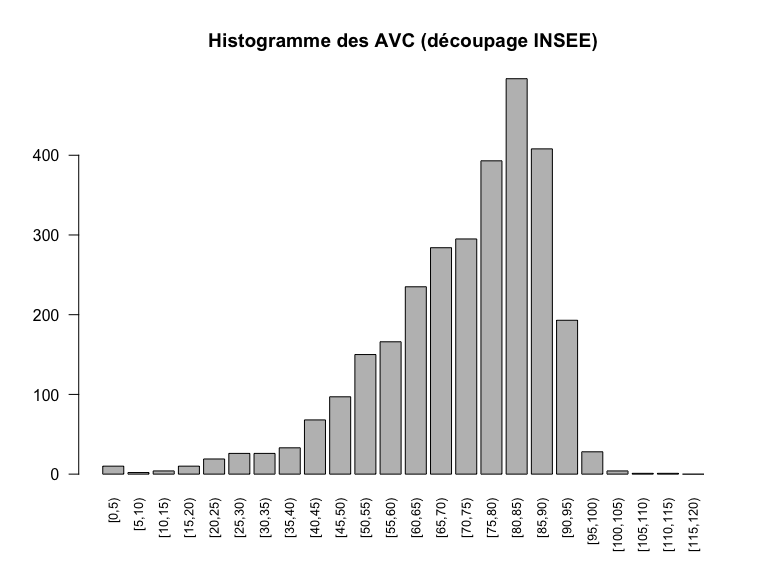

Version mse à jour le: __Wed Aug 26 10:24:59 2015__

Ajout de la dernière version de Gilles 

- nombre de passages pour 10.000 hab.
- nombre de SU pour 10.000 hab.
- nombre de lignes SMUR financées par une MIG
- nombre de siège de SMUR dont SMUR saisonnier dont antenne SMUR dont hélismur
- séparer privés lucratifs et ESPIC
- nombre de logicels et nombre de SU par région
- SAE 2014 ?
- augmentation par rapport année N-1 en tenant compte uniquement des établissements "stables"
- séparer chu et non chu, samu de chu et de non chu
- retour attendu pour le 4/9


Activité des structures d’urgences : panorama 2014 de la région ALSACE
=========================================================================
Rapport 2014 respectant les préconisations de la FEDORU. Source:
[Trame commune](https://docs.google.com/document/d/101LYVqVLeHZnrujfMm3aqBYfbOwx3CPEB3Y-Lbud2Ls/edit)

Le document de référence pour le rapport est: __V4 trame commune 2014 rapport inter région__ (xps: /home/jcb/Documents/Resural/FEDORU/Trame_Commune/DOC/Trame commune 2014 rapport inter région (V4).docx)

__NOTE__: certaines informations utiles sont dans __RPU_Doc__.

LE MOT DU PRÉSIDENT DE LA FEDORU
================================


La publication du panorama des urgences de la région __ALSACE__constitue une excellente occasion pour présenter la fédération des observatoires régionaux des urgences (FEDORU) qui compte __RESURAL__ parmi ses membres actifs.

La FEDORU a été créée au mois d'octobre 2013. Ses membres sont chargés dans leur région respective du traitement des données d'urgences ; ce point commun est le trait d'origine de la FEDORU et donne son empreinte à l'objet de notre association que je cite ici :

- promouvoir les observatoires régionaux des urgences et les structures ayant une activité similaire ;
- promouvoir toutes les actions visant à améliorer la connaissance sur les soins de premier recours ;
- partager les expertises dans le domaine du recueil, de l’analyse et de l’évaluation de la qualité des données relatives à l’activité des urgences.

Les premières publications de la FEDORU (disponibles sur le site : http://www.fedoru.fr) abordent les thèmes techniques suivants :

- Recommandations pour la création d’un ORU
- Collecte et usage des RPU
- Hôpital en tension - Synthèse FEDORU

Ces documents constituent le socle indispensable à la conduite de travaux inter-régionaux. Nous pourrons ainsi comparer nos résultats, harmoniser les indicateurs retenus dans nos publications respectives, travailler sur des échantillons de données plus importants(inter-région ou national), mais aussi évaluer l'impact de différentes organisations.

La recherche de consensus et d’échanges entre les différents acteurs régionaux représentés au sein de la FEDORU s’illustre parfaitement dans cette publication qui prend le parti de respecter les premières recommandations sur le traitement des RPU. Le “panorama des urgences en région ….”, intègre le format d’analyse commun 2015 proposé de manière collégiale par nos groupes experts et validé par notre conseil d’administration. Ce socle d’analyse produit par “la structure concernée” sera rapproché des résultats des autres régions et donnera lieu à une publication commune au cours de l’année 2015.
J’adresse au nom de la FEDORU toutes mes félicitations à l’ensemble de l’équipe de __RESURAL__ pour la qualité de leurs travaux mais aussi et surtout à tous les professionnels des services d’urgences de l'__ALSACE__ pour le fastidieux mais si précieux travail de collecte sur le terrain.

__Dr G. VIUDES__

_Président de la FEDORU_

Description de l’offre de soins
===============================

Qualité des données 
-------------------
Réalisation d’un diagramme radar présentant l’exhaustivité des items RPU.

  

Complétude en valeur absolue et en pourcentages:`

```
##           FINESS               ID          EXTRACT      CODE POSTAL 
##           416733           416733           415731           416733 
##          COMMUNE        NAISSANCE             SEXE    DATE D'ENTREE 
##           416716           416733           416733           416733 
##    MODE D'ENTREE       PROVENANCE        TRANSPORT    TRANSPORT PEC 
##           391370           239122           289308           283189 
##   DATE DE SORTIE   MODE DE SORTIE      DESTINATION      ORIENTATION 
##           374349           338878            82635            72898 
## MOTIF DE RECOURS             CCMU               DP 
##           270962           339827           245974
```

```
##           FINESS               ID          EXTRACT      CODE POSTAL 
##              100              100              100              100 
##          COMMUNE        NAISSANCE             SEXE    DATE D'ENTREE 
##              100              100              100              100 
##    MODE D'ENTREE       PROVENANCE        TRANSPORT    TRANSPORT PEC 
##               94               57               69               68 
##   DATE DE SORTIE   MODE DE SORTIE      DESTINATION      ORIENTATION 
##               90               81              100               88 
## MOTIF DE RECOURS             CCMU               DP 
##               65               82               60
```

Les chiffres clés de l’activité des services d’urgences
=======================================================

Le format des chiffres clés est celui défini par la FEDORU. Il est commun à toutes les régions membres de la FEDORU.

Recueil des données
-------------------

- Nombre de passages dans l'année: 432 170 (données SAE 2014)
- Nombre de RPU déclarés: __416 733 RPU__
- Exhaustivité du recueil: __96.43 %__
- Moyenne quotidienne de passages: __1 142 RPU/jour__
- %(N) d'évolution par rapport à année 2013: __22 %__.
- % d’évolution moyenne sur les 5 dernières années (méthode calcul : _pas de données disponibles_.
- Données renseignées (données à partir desquelles tout le reste de l’analyse sera effectuée) = Nombre de RPU transmis: 416 733 RPU
    

PATIENTS
--------
### Sexe


- %(N) Femme: 47.78 % (217 617)
- %(N) Homme: 52.22 % (199 110)
- Sex ratio: __1.09__
- Taux de masculinité: 0.52

### Age


- age moyen: __38 ans__.
- age moyen des hommes: 35.9 ans.
- age moyen des femmes: 40.3 ans.

- % (N) < 1 an: 15 376 (__3.69 %__)
- %(N) < 15 ans: 103 413 (__24.82 %__)
- %(N) < 18 ans: 119 213 (__28.61 %__)
- %(N) >= 75 ans: 57 271 (__13.74 %__)
- Pyramide des ages:

 

### Taux de recours (définition FEDORU) régional aux urgences.

Le taux de recours régional est calculé à partir des données de l'INSEE.


TARRU: __21.31%__ (ref: population alsacienne 2014)

### Pourcentage  de patients ne venant pas de la région (étranger compris)


Part des non résidents: __4.43%__ (N = format.n(18467))

ARRIVÉE
-------


### Horaires de passage

  

- Passages de nuit (20h - 8h): __27.7 %__ (N = 115 418)
- Passages en nuit profonde (0h - 8h): __10.38 %__ (N = 43 271)


- Passages en horaire de PDSA: __45.22 %__ [N = 188 454](Remarque: ne tient pas compte des jours fériés survenant en semaine)

### Variations saisonnières

Variation du nombre de RPU entre les mois d'été (juillet-août) et les autres mois de l'année: __-5.82 %__.

### Moyens d'arrivée


- %(N) d'arrivée personnel: __NA %__ (N = NA)
- %(N) d'arrivée SMUR: __NA %__ (N = NA)
- %(N) d'arrivée VSAB: __NA %__ (N = NA)
- %(N) d'arrivée Ambulance: __NA %__ (N = NA)

NB : commentaire possible pour expliquer que la somme des 4 pourcentages ci dessus ne fait pas 100 %

### Gravité (CCMU)


- nombre de CCMU renseignés: 339 827.
- %(N) CCMU 1: __NA%__ (n = NA)
- %(N) CCMU 1 et 2: __NA%__ (n = NA)
- %(N) CCMU 4 et 5: __NA%__ (n = NA)

Exhaustivité CCMU :

- Nombre de RPU 2014 hors orientation = FUGUE, PSA et REO ayant un élément transmis pour la CCMU: __335 889__.

### Diadnostic principal 

Remarque: les chiffres sont dans le document _Codes_regroupement_ORUMIP_ => à rajouter.

- %  Médico-chirurgical: __136 816__
- %  Traumatologique: __91 907__
- %  Psychiatrique: __6 185__
- %  Toxicologique: __4 847__
- %  Autres recours: __7 441__

### Durées de passage

 

- Nombre de RPU dont la durée de passage est comprise entre 0h et 72h: __338 722__
- durée moyenne de passage __226 mn__ (3h46).
- écart-type: NA mn (NAhNA).
- médiane: __191 mn__ (3h11).
- nombre de prises en charge > 4 heures: 18 121 (__5.35 %__).
- nombre de prises en charge inférieures ou égales à 4 heures: 320 601 (__94.65 %__).

- Lors d’une hospitalisation post-urgences (hospitalisation = mutation + transfert)
    - moyenne durée de passage en cas d’hospitalisation: __239.29 mn__.
    - médiane durée de passage en cas d’hospitalisation: __205 mn__.
    
- Lors d’un retour au domicile
    - moyenne durée de passage en cas de retour à domicile: __NA mn__.
    - médiane durée de passage en cas de retour à domicile: __NA mn__.

(source: temps de passages.Rmd)

### Mode de sortie


- % (N) de retour à domicile: __75.5 %__ (N = 255 852)
- % (N) Hospitalisation: __24.5 %__ (N = 83 024)
- % (N) Mutation: __22.72 %__ (N = 76 999)
- % (N) Transfert: __1.78 %__ (N = 6 025)
- Nb de RPU 2014  avec mode de sortie = 6 ou 7 (hospitalisation) avec un élément transmis pour la destination: __82635__
- Nb de RPU 2014 avec mode de sortie = 6 ou 7 avec un élement transmis pour l'orientation: __72898__


Les chiffres clés de l’activité des SAMU
========================================
 (à partir des données SRVA "officielles")
 


- Nombre de dossiers de régulation médicale (DRM): 480303
- Nombre de SMUR : 25 321
    - dont primaires: format.n(19714)
- Nombre d’ambulances privées à la demande du SAMU: format.n(46031)

Organisation
------------
Nombre de colonnes SMUR:

SMUR  |  Jour  |  Nuit   
------|--------|------
Wissembourg  |  1  |  1   
Haguenau  |  1  |  1   
Saverne  |  1  |  1   
Strasbourg  |  4  |  3   
Sélestat  |  1  |  1   
Colmar  |  2  |  2     
Mulhouse  |  2  |  2   

Les chiffres clés de l’activité pédiatrique des services d’urgences (moins de 18 ans)
=====================================================================================


```
## ped
##      <28j  28j-1an[   1-5ans[  5-10ans[ 10-15ans[ 15-18ans[ 
##      1791     13554     36287     24738     27012     15800
```

 

# par tranche d'age de 5 ans, borne sup exclue: [0-5[ ans
p <- pyramide.age(pop18, cut = 1, gap = 0.3)

#---------------------- Chiffres ---------------------------------------------------------------
#---------------------- Chiffres end -----------------------------------------------------------

```
RECUEIL DES DONNÉES
-------------------
- Nombre de passages dans l'année: 119 213
- Moyenne quotidienne de passage: 327 passages/j
- Taux d'urgences pédiatriques [(Nb RPU Pédia/ Nb RPU global)x100]: 29 %
- TODO: % d'évolution par rapport à l'année N-1(données SAE pour ceux qui n’ont pas d’historique RPU fiable et permettant la comparaison, préciser l’origine des données)

PATIENTS
--------

```
 AMBU    FO  HELI PERSO  SMUR  VSAB        NA's 
 2024    81    17 71809   706  3053     0 41523 
```

```
[1] 77690
```

```
[1] 94706
```

```
    1     2     3     4     5     D     P        NA's 
24353 63361  6678   211    23     2    78     0 24507 
```
- nombre de garçons: 65619
- nombre de filles: 53590
- Sex ratio: 1.22
- Pyramide des âges (âge par année, borne supérieure toujours exclue)
- Par sous classes d’âge:


### horaires de passages pédiatriques

- nombre de passages la nuit: 32677, 0.27 (p = 27.41, 0 %)
- nombre de passages en nuit profonde: 8660, 0.07 (p = 7.26, 0 %)

### Durée de passage


- Nombre de RPU avec une heure de sortie conforme (]0-72h[: 106660
- Durée moyenne de passage (en min): NA mn
- Durée médiane de passage (en min): NA mn
- Nombre de RPU dont la durée de passage est inférieure à 4h: 105548
- Nombre de RPU avec une heure de sortie conforme (]0-72h[ lors d'une hospitalisation post-urgences: 8771
- Nombre de RPU avec une heure de sortie conforme (]0-72h[ lors d'un retour au domicile: 1328
- Nombre de RPU dont la durée de passage est inférieure à 4h lors d'une hospitalisation post-urgences: 7845
- Nombre de RPU dont la durée de passage est inférieure à 4h lors d'un retour au domicile: 97702

- Nombre de RPU avec un mode de sortie renseigné: 96860
- Nombre de mutation interne: 11996
- Nombre de transfert externe: 556
- nombre de retours à domicile: 84307

Les chiffres clés de l’activité gériatrique des services d’urgences (75 ans et plus)
====================================================================================

RECUEIL DES DONNÉES
-------------------
- Nombre de passages dans l'année: 57 271
- Moyenne quotidienne de passage: 157 passages/j
- Taux d'urgences gériatriques [(Nb RPU Géria/ Nb RPU global)x100]: 13.74 %
- TODO: % d'évolution par rapport à l'année N-1(données SAE pour ceux qui n’ont pas d’historique RPU fiable et permettant la comparaison, préciser l’origine des données)

PATIENTS
--------
 

```
               effectif moyenne par jour  médiane par jour sex ratio
75-84 ans         33399                92               91      0.82
85 ans et plus    23872                65               66      0.47
```
- Nombre d'hommes: 22 665
- Nombre de femmes: 34 605
- Sex ratio: 0.65
- Pyramide des âges (âge par année, borne supérieure toujours exclue)
- Par sous classes d’âge:

                  effectif   moyenne par jour    médiane par jour   sex ratio
---------------  ---------  ------------------  -----------------  ----------
75-84 ans            33399                  92                 91        0.82
85 ans et plus       23872                  65                 66        0.47

 

ARRIVÉE
-------

### Horaires de passage


- Nb de RPU avec date/heure d'entrée renseignés: 57 271
- %  passages la nuit: 22.38 % (N = 12 815)
- %  passages en horaire de PDS: 38.12 % (N = 21 830)

### Moyens de transport


- nombre de moyens de transport: 57271
- nombre de moyens de transport renseignés: 40878
- nombre de moyens personnels: NA
- nombre de SMUR: NA
- nombre de VSAV: NA
- nombre d'ambulances privées: NA

- %  d’arrivées Moyen perso: 20.89 % (N = 11 962)
- %  d'arrivées SMUR: 1.22 % (N = 698)
- %  d'arrivées VSAV: 11.87 % (N = 6 797)
- %  d'arrivées ambulance privée: 37.31 % (N = 21 370)
- % réponses manquantes: 

NB : commentaire possible pour expliquer que la somme des 4 pourcentages ci dessus ne fait pas 100 % 

### Gravité


- Nombre de RPU avec une CCMU renseignée: 47408
- %  CCMU 1: 4.32 % (N = 2 472)
- %  CCMU 4 et 5: 3.14 % (N = 1 797)

### Diagnostic principal


- % Médico-chirurgical: 55.35 %
        - dont :
    - % cardio vasculaire
    - % neuro
    - % digestif
    - % respiratoire
- %  Traumatologique: 37.18 %
- %  Psychiatrique: 2.5 %
- %  Toxicologique: 1.96 %
- %  Autres recours: 3.01 %

### DURÉE


```
##        NA  Mutation Transfert  Domicile     Décès           
##        NA       219       316       215        NA        NA
```

```
##        NA  Mutation Transfert  Domicile     Décès           
##        NA       200       248       174        NA        NA
```

```
## 
## 	Welch Two Sample t-test
## 
## data:  passages75$duree by passages75$DEVENIR
## t = -4.8, df = 41184, p-value = 0.000001585
## alternative hypothesis: true difference in means is not equal to 0
## 95 percent confidence interval:
##  -12.7  -5.3
## sample estimates:
## mean in group Domicile     mean in group Hosp 
##                    215                    224
```

```
## [1] 0.0000016
```

 

- Durée moyenne de passage (HORS UHCD) : 220 minutes
- Durée médiane de passage (HORS UHCD) : 190 minutes
- %  de passages de moins de 4h : 61.22 %
- lors d’une hospitalisation post-urgences (hospitalisation = mutation + transfert): 223.7 minutes.
- lors d’un retour au domicile: 214.71 minutes.

#### Nouveau
- Nombre de RPU avec une heure de sortie conforme (]0-72h[: 37603
- Durée moyenne de passage (en min): NA mn
- Durée médiane de passage (en min): NA mn
- Nombre de RPU dont la durée de passage est inférieure à 4h: 29856

- Nombre de RPU avec une heure de sortie conforme (]0-72h[ lors d'une hospitalisation post-urgences: 13887

- Nombre de RPU avec une heure de sortie conforme (]0-72h[ lors d'un retour au domicile: 416

- Nombre de RPU dont la durée de passage est inférieure à 4h lors d'une hospitalisation post-urgences: 6318

- Nombre de RPU dont la durée de passage est inférieure à 4h lors d'un retour au domicile: 23538

### MODE DE SORTIE

 

```
## pop75$MODE_SORTIE : 
##           Frequency   %(NA+)   %(NA-)
## Mutation      27196     47.5     58.1
## Domicile      18131     31.7     38.7
## NA's          10430     18.2      0.0
## Transfert      1514      2.6      3.2
## NA                0      0.0      0.0
## Décès             0      0.0      0.0
##                   0      0.0      0.0
##   Total       57271    100.0    100.0
```

- %  d’hospitalisation: 50.13 % (N = 28 710)
    - % de mutation:47.49 % (N = 27 196)
    - % de transfert:2.64 % (N = 1 514)
- %  de retour à domicile:31.66 % (N = 18 131)

#### rapport régional

- Nombre de RPU avec un mode de sortie renseigné: 46 841
- Nombre de mutation interne: 27 196
- Nombre de transfert externe: 1 514
- nombre de retours à domicile: 18 131


Les chiffres clés de l’activité AVC des services d’urgences
===========================================================


RECUEIL DES DONNÉES
-------------------

- Nombre d’AVC dans l'année (+ rappeler le pourcentage d’exhaustivité du DP par rapport au nombre de RPU): __2 949__
- Moyenne quotidienne d’AVC: __8,1 AVC/j__
- %  d’AVC dans l’activité globale: __1.19 %__

Répartition des AVC
-------------------
Exemple d'utilisation de la méthode _hist_ appliquée aux objets date-time:

- _x_ = as.Date(AVC$ENTREE)
- _breaks_ est obligatoire: "days", "weeks", "months", "quarters", "years", "secs", "mins", "hours". Utiliser _start.on.monday = TRUE_ si _breaks = "weeks"_.
- _freq_ = TRUE (défaut FALSE) pour afficher les fréquences
- _format_ permet de coisir l'affichage de la date sur l'axe des x [voir](https://stat.ethz.ch/R-manual/R-devel/library/base/html/strptime.html).


 


PATIENTS
--------

```
## c.age
##     [0,5)    [5,10)   [10,15)   [15,20)   [20,25)   [25,30)   [30,35) 
##        10         2         4        10        19        26        26 
##   [35,40)   [40,45)   [45,50)   [50,55)   [55,60)   [60,65)   [65,70) 
##        33        68        97       150       166       235       284 
##   [70,75)   [75,80)   [80,85)   [85,90)   [90,95)  [95,100) [100,105) 
##       295       393       496       408       193        28         4 
## [105,110) [110,115) [115,120) 
##         1         1         0
```

 

```
## c.age
##    [0,1)    [1,5)   [5,10)  [10,15)  [15,18)  [18,30)  [30,45)  [45,65) 
##        3        7        2        4        4       51      127      648 
##  [65,75)  [75,85) [85,120) 
##      579      889      635
```

 

- Sex ratio: 0.95
- Age moyen: 71.44 ans
- Nombre d’AVC par sous classe d’âge (GT1):

ARRIVÉE
--------
- Nombre d’AVC et % par tranche d’heure GT1 (matinée, début d’après midi, fin d’après midi, soirée, nuit profonde)

```
##      nuit profonde matinée  début après-midi fin après-midi soirée   
## [1,] "[0,8)"       "[8,12)" "[12,16)"        "[16,20)"      "[20,24)"
## [2,] "272"         "900"    "865"            "619"          "293"
```

 

- % AVC le matin: 30.5 %.
- % AVC en début d'après-midi: 29.3 %.
- % AVC en fin d'après-midi: 21 %.
- % AVC en soirée: 9.9 %.
- % AVC le nuit profonde: 9.2 %.

- Nombre de passages AVC urgences, déclinaison par département, établissement, année N

```
## 3Fr Alk Ane Col Dia Dts Geb Hag Hus Mul Odi Ros Sav Sel Wis 
##  63  30  NA 741  NA  NA  30 500 580 682  NA  NA  NA 238  85
```


- %  passages en horaire de PDS


              PDSS   PDSWE   NPDS
-----------  -----  ------  -----
Nombre AVC     403     656   1890
% AVC           14      22     64

PDSS = horaires de PDS en semaine, PDSWE = horaires de PDS le WE, NPDS = hors horaire de PDS.

- nombre d'AVC aux horaires de PDS en semaine: 13.67 %
- nombre d'AVC aux horaires de PDS de week-end:22.24 %
- nombre d'AVC en dehors des horaires de PDS:64.09 %
- Nombre de RPU avec diag AVC avec date et heure d'entrées renseignées: 2 949

Mode d'arrivée aux urgences
---------------------------


```
##          n       n.na       p.na     n.rens     p.rens       n.fo 
## 2949.00000  554.00000    0.18786 2395.00000    0.81214    1.00000 
##     n.heli    n.perso     n.smur     n.vsav     n.ambu       p.fo 
##   19.00000  636.00000   58.00000  527.00000 1154.00000    0.00042 
##     p.heli    p.perso     p.smur     p.vsav     p.ambu 
##    0.00793    0.26555    0.02422    0.22004    0.48184
```
- Nombre de RPU avec moyens de transport précisé: 2 395
- %  d’arrivées Moyen perso: 21.57%
- %  d'arrivées SMUR: 1.97%
- %  d'arrivées VSAV: NA%
- %  d'arrivées ambulance privée: 39.13%
NB : commentaire possible pour expliquer que la somme des 4 pourcentages ci dessus ne fait pas 100 %

Diagnostic principal
--------------------


- Nombre d’AVC ischémiques et %: 1 021 (34.62 %)
- Nombre d’AVC hémorragiques et %: 442 (14.99 %)
- Nombre d’AIT et %: 806 (27.33 %)
- Nombre de codes "symptomatiques" (hémiplégie, aphasie, amaurose, etc…) et %: 680 (23.06 %)

NB : se référer à l’annexe 4 pour les regroupements.

DURÉE
-----
Voir ligne 333

Voir les routines de RPU_2014/Analyse/Temps_passage/passage.R et notamment __temps de passage__.


- Nombre de RPU avec une heure de sortie conforme (]0-72h[: 1 899
- Durée moyenne de passage des patients PEC pour AVC (en min): NA
- Durée médiane de passage des patients PEC pour AVC (en min): NA
- Nombre de RPU ac diag AVC dont la durée de passage est inférieure à 4h: 1 248

- Durée de passage (HORS UHCD) année N: moyenne __249.8__ minutes, et médiane __228__ minutes.
- % de passages de moins de 4h 0.92


MODE DE SORTIE
--------------
 

- Nombre de RPU ac diag. AVC avec un mode de sortie renseigné: 2626
- % d’hospitalisation: 87.3 % (N = 2292)
- % de mutation: 81.3 % (N = 2134)
- % de transfert: 6 % (N = 158)
- % de retour à domicile: 12.7 % (N = 334)

Orientation
----------
- Répartition par orientation en pourcentage, année N


% Table created by stargazer v.5.2 by Marek Hlavac, Harvard University. E-mail: hlavac at fas.harvard.edu
% Date and time: Mer, aoû 26, 2015 - 10:27:16
\begin{table}[!htbp] \centering 
  \caption{Orientation des AVC} 
  \label{orientation} 
\begin{tabular}{@{\extracolsep{5pt}} cccccccccc} 
\\[-1.8ex]\hline 
\hline \\[-1.8ex] 
CHIR & FUGUE & HO & MED & REA & SC & SCAM & SI & UHCD & NA's \\ 
\hline \\[-1.8ex] 
$75$ & $1$ & $1$ & $720$ & $68$ & $46$ & $9$ & $361$ & $919$ & $749$ \\ 
\hline \\[-1.8ex] 
\end{tabular} 
\end{table} 

Analyse par type d'étblissement
===============================

Voir routine __analyse-type_etablissement__ (rapport_2014.R).

SU de CHU
---------

Un seul établissement __HUS__ avec 3 SU:

- NHC
- HTP Adultes
- HTP Pédiatrie


- Nombre de passages déclarés: 61 793 en 2014.
- Nombre de RPU avec un âge renseigné: 61 793.
- Nombre de RPU avec un code postal renseigné: 61 793.
- Nombre de passages par jour de la semaine:
        - Lundi: 9 211
        - Mardi: 8 980
        - Mercredi: 8 527
        - Jeudi: 8 667
        - Vendredi: 9 170
        - Samedi: 8 806
        - Dimanche: 8 432
- Nombre d'âges renseignés: NA
        - moins d'un an: 15 376
        - moins de 15 ans: NA
        - 75 ans et plus: 57 271

SU d'ES siège de SAMU, non CHU
------------------------------

Un seul établissement: CH de Mulhouse avec 2 implantations:

- Emile Muller (Adultes + Pédiatrie traumatique)
- Hasenrain (Pédiatrie médicale)


```
[1] 59471
```

```
         n       n.na       p.na     n.rens     p.rens   n.inf1an 
 59471.000      0.000      0.000  59471.000      1.000  15376.000 
n.inf15ans n.inf18ans    n.75ans    n.85ans    n.90ans   p.inf1an 
103413.000 119213.000  57271.000  23872.000   9487.000      0.037 
p.inf15ans p.inf18ans    p.75ans    p.85ans    p.90ans   mean.age 
     0.248      0.286      0.137      0.057      0.023     34.600 
    sd.age median.age    min.age    max.age         q1         q3 
    28.078     30.000      0.000    113.000      8.000     57.000 
```

```
          n        n.na        p.na      n.rens      p.rens n.residents 
      59471           0           0       59471           1       57952 
n.etrangers 
       1519 
```

```
 Lun  Mar  Mer  Jeu  Ven  Sam  Dim 
8868 7885 8130 7931 8270 8854 9533 
```

```
         n       n.na       p.na     n.rens     p.rens   n.inf1an 
 59471.000      0.000      0.000  59471.000      1.000  15376.000 
n.inf15ans n.inf18ans    n.75ans    n.85ans    n.90ans   p.inf1an 
103413.000 119213.000  57271.000  23872.000   9487.000      0.037 
p.inf15ans p.inf18ans    p.75ans    p.85ans    p.90ans   mean.age 
     0.248      0.286      0.137      0.057      0.023     34.600 
    sd.age median.age    min.age    max.age         q1         q3 
    28.078     30.000      0.000    113.000      8.000     57.000 
```

```
[1] 18349.00     0.31
```

```

 NPDS  PDSS PDSWE 
30530 12634 16307 
```

```
     n   n.na   p.na n.rens p.rens 
 59471      0      0  59471      1 
```

```
         n       n.na       p.na     n.rens     p.rens       n.fo 
59471.0000  3836.0000     0.0645 55635.0000     0.9355   478.0000 
    n.heli    n.perso     n.smur     n.vsav     n.ambu       p.fo 
  122.0000 35973.0000   223.0000  7051.0000 11788.0000     0.0086 
    p.heli    p.perso     p.smur     p.vsav     p.ambu 
    0.0022     0.6466     0.0040     0.1267     0.2119 
```

```
         n       n.na       p.na     n.rens     p.rens    n.ccmu1 
59471.0000 14043.0000     0.2361 45428.0000     0.7639  7349.0000 
   n.ccmu2    n.ccmu3    n.ccmu4    n.ccmu5    n.ccmup    n.ccmud 
30451.0000  6094.0000  1235.0000   299.0000         NA         NA 
   p.ccmu1    p.ccmu2    p.ccmu3    p.ccmu4    p.ccmu5    p.ccmup 
    0.1618     0.6703     0.1341     0.0272     0.0066         NA 
   p.ccmud 
        NA 
```

```
                n.conforme      duree.moyenne.passage 
                     47518                         NA 
     duree.mediane.passage  duree.moyenne.passage.dom 
                        NA                         NA 
 duree.mediane.passage.dom duree.moyenne.passage.hosp 
                        NA                        238 
duree.mediane.passage.hosp                 n.passage4 
                       213                      44737 
           n.hosp.passage4             n.dom.passage4 
                      3358                      41379 
                     n.dom                     n.hosp 
                       362                       5926 
               n.transfert                 n.mutation 
                        20                       5906 
                   n.deces 
                         0 
```

```
          n        n.na        p.na      n.rens      p.rens       n.dom 
 59471.0000  14257.0000      0.2397  45214.0000      0.7603  36717.0000 
     n.hosp n.transfert  n.mutation     n.deces       p.dom      p.hosp 
  8497.0000    150.0000   8347.0000      0.0000      0.8121      0.1879 
p.transfert  p.mutation     p.deces 
     0.0033      0.1846      0.0000 
```

SU avec SMUR non siège de SAMU
------------------------------

SU abec SMUR sans SAMU, 5 établissements:

- CH Wissembourg
- CH haguenau
- CH Saverne
- CH Sélestat
- CH Colmar


```
[1] 177747
```

```
         n       n.na       p.na     n.rens     p.rens   n.inf1an 
177747.000      0.000      0.000 177747.000      1.000  15376.000 
n.inf15ans n.inf18ans    n.75ans    n.85ans    n.90ans   p.inf1an 
103413.000 119213.000  57271.000  23872.000   9487.000      0.037 
p.inf15ans p.inf18ans    p.75ans    p.85ans    p.90ans   mean.age 
     0.248      0.286      0.137      0.057      0.023     37.300 
    sd.age median.age    min.age    max.age         q1         q3 
    27.737     33.000      0.000    120.000     13.000     59.000 
```

```
          n        n.na        p.na      n.rens      p.rens n.residents 
     177747           0           0      177747           1      166676 
n.etrangers 
      11071 
```

```
  Lun   Mar   Mer   Jeu   Ven   Sam   Dim 
27415 24007 24628 24099 24688 25896 27014 
```

```
         n       n.na       p.na     n.rens     p.rens   n.inf1an 
177747.000      0.000      0.000 177747.000      1.000  15376.000 
n.inf15ans n.inf18ans    n.75ans    n.85ans    n.90ans   p.inf1an 
103413.000 119213.000  57271.000  23872.000   9487.000      0.037 
p.inf15ans p.inf18ans    p.75ans    p.85ans    p.90ans   mean.age 
     0.248      0.286      0.137      0.057      0.023     37.300 
    sd.age median.age    min.age    max.age         q1         q3 
    27.737     33.000      0.000    120.000     13.000     59.000 
```

```
[1] 46677.00     0.26
```

```

 NPDS  PDSS PDSWE 
98847 32166 46734 
```

```
     n   n.na   p.na n.rens p.rens 
177747      0      0 177747      1 
```

```
          n        n.na        p.na      n.rens      p.rens        n.fo 
177747.0000  41213.0000      0.2319 136534.0000      0.7681    760.0000 
     n.heli     n.perso      n.smur      n.vsav      n.ambu        p.fo 
    95.0000  97489.0000   1603.0000  14816.0000  21771.0000      0.0056 
     p.heli     p.perso      p.smur      p.vsav      p.ambu 
     0.0007      0.7140      0.0117      0.1085      0.1595 
```

```
           n         n.na         p.na       n.rens       p.rens 
177747.00000  21649.00000      0.12180 156098.00000      0.87820 
     n.ccmu1      n.ccmu2      n.ccmu3      n.ccmu4      n.ccmu5 
 27108.00000 101455.00000  24309.00000   1547.00000    385.00000 
     n.ccmup      n.ccmud      p.ccmu1      p.ccmu2      p.ccmu3 
  1273.00000     21.00000      0.17366      0.64994      0.15573 
     p.ccmu4      p.ccmu5      p.ccmup      p.ccmud 
     0.00991      0.00247      0.00816      0.00013 
```

```
                n.conforme      duree.moyenne.passage 
                    158099                         NA 
     duree.mediane.passage  duree.moyenne.passage.dom 
                        NA                         NA 
 duree.mediane.passage.dom duree.moyenne.passage.hosp 
                        NA                        237 
duree.mediane.passage.hosp                 n.passage4 
                       205                     146169 
           n.hosp.passage4             n.dom.passage4 
                     16272                     129896 
                     n.dom                     n.hosp 
                      3330                      27522 
               n.transfert                 n.mutation 
                       875                      26647 
                   n.deces 
                         1 
```

```
            n          n.na          p.na        n.rens        p.rens 
177747.000000  10215.000000      0.057469 167532.000000      0.942531 
        n.dom        n.hosp   n.transfert    n.mutation       n.deces 
126977.000000  40554.000000   2990.000000  37564.000000      1.000000 
        p.dom        p.hosp   p.transfert    p.mutation       p.deces 
     0.757927      0.242067      0.017847      0.224220      0.000006 
```


SU non SMUR, non SAMU, non CHU
------------------------------

ES avec SU isolé (pas de SMUR associé): 8 établissements

- Ste Anne
- Ste Odile
- Diaconat Strasbourg
- CH de Guebwiller
- CH de Thann (pas de RPU)
- CH d'Altkirch
- Clinique des 3 frontières
- Roosvelt
- Fonderie


```
[1] 117722
```

```
            n          n.na          p.na        n.rens        p.rens 
117722.000000      4.000000      0.000034 117718.000000      0.999966 
     n.inf1an    n.inf15ans    n.inf18ans       n.75ans       n.85ans 
 15376.000000 103413.000000 119213.000000  57271.000000  23872.000000 
      n.90ans      p.inf1an    p.inf15ans    p.inf18ans       p.75ans 
  9487.000000      0.036897      0.248154      0.286068      0.137430 
      p.85ans       p.90ans      mean.age        sd.age    median.age 
     0.057284      0.022765     38.500000     23.926814     35.000000 
      min.age       max.age            q1            q3 
     0.000000    108.000000     19.000000     56.000000 
```

```
          n        n.na        p.na      n.rens      p.rens n.residents 
     117722           0           0      117722           1      114350 
n.etrangers 
       3372 
```

```
  Lun   Mar   Mer   Jeu   Ven   Sam   Dim 
18645 15880 16232 16002 16456 17567 16940 
```

```
            n          n.na          p.na        n.rens        p.rens 
117722.000000      4.000000      0.000034 117718.000000      0.999966 
     n.inf1an    n.inf15ans    n.inf18ans       n.75ans       n.85ans 
 15376.000000 103413.000000 119213.000000  57271.000000  23872.000000 
      n.90ans      p.inf1an    p.inf15ans    p.inf18ans       p.75ans 
  9487.000000      0.036897      0.248154      0.286068      0.137430 
      p.85ans       p.90ans      mean.age        sd.age    median.age 
     0.057284      0.022765     38.500000     23.926814     35.000000 
      min.age       max.age            q1            q3 
     0.000000    108.000000     19.000000     56.000000 
```

```
[1] 27711.00     0.24
```

```

 NPDS  PDSS PDSWE 
68659 19254 29809 
```

```
     n   n.na   p.na n.rens p.rens 
117722      0      0 117722      1 
```

```
            n          n.na          p.na        n.rens        p.rens 
117722.000000  28900.000000      0.245494  88822.000000      0.754506 
         n.fo        n.heli       n.perso        n.smur        n.vsav 
   264.000000      1.000000  74095.000000    602.000000   5825.000000 
       n.ambu          p.fo        p.heli       p.perso        p.smur 
  8035.000000      0.002972      0.000011      0.834196      0.006778 
       p.vsav        p.ambu 
     0.065581      0.090462 
```

```
            n          n.na          p.na        n.rens        p.rens 
117722.000000  12916.000000      0.109716 104806.000000      0.890284 
      n.ccmu1       n.ccmu2       n.ccmu3       n.ccmu4       n.ccmu5 
  8482.000000  85521.000000  10593.000000    147.000000     24.000000 
      n.ccmup       n.ccmud       p.ccmu1       p.ccmu2       p.ccmu3 
    34.000000      5.000000      0.080930      0.815993      0.101072 
      p.ccmu4       p.ccmu5       p.ccmup       p.ccmud 
     0.001403      0.000229      0.000324      0.000048 
```

```
                n.conforme      duree.moyenne.passage 
                    106689                         NA 
     duree.mediane.passage  duree.moyenne.passage.dom 
                        NA                         NA 
 duree.mediane.passage.dom duree.moyenne.passage.hosp 
                        NA                        180 
duree.mediane.passage.hosp                 n.passage4 
                       150                     105246 
           n.hosp.passage4             n.dom.passage4 
                      3193                     102052 
                     n.dom                     n.hosp 
                      2440                       4199 
               n.transfert                 n.mutation 
                      1203                       2996 
                   n.deces 
                         1 
```

```
           n         n.na         p.na       n.rens       p.rens 
117722.00000  18046.00000      0.15329  99676.00000      0.84671 
       n.dom       n.hosp  n.transfert   n.mutation      n.deces 
 89036.00000  10639.00000   2770.00000   7869.00000      1.00000 
       p.dom       p.hosp  p.transfert   p.mutation      p.deces 
     0.89325      0.10674      0.02779      0.07895      0.00001 
```

Test de la routine et tableau compact


```
##                 es.chu es.samu es.smur es.simple
## n.passages       61793   59471  177747    117722
## n.age.ren        61793   59471  177747    117718
## n.inf1an         15376   15376   15376     15376
## n.inf15ans      103413  103413  103413    103413
## n.75ans          57271   57271   57271     57271
## n.cp.rens        61793   59471  177747    117722
## n.etrangers       2505    1519   11071      3372
## n.lun             9211    8868   27415     18645
## n.mar             8980    7885   24007     15880
## n.mer             8527    8130   24628     16232
## n.jeu             8667    7931   24099     16002
## n.ven             9170    8270   24688     16456
## n.sam             8806    8854   25896     17567
## n.dim             8432    9533   27014     16940
## n.nuit           22681   18349   46677     27711
## n.pds            31550   28941   78900     49063
## n.h.rens         61793   59471  177747    117722
## n.trans.rens      8317   55635  136534     88822
## n.fo                NA      NA      NA        NA
## n.heli              NA      NA      NA        NA
## n.perso             NA      NA      NA        NA
## n.smur              NA      NA      NA        NA
## n.vsav              NA      NA      NA        NA
## n.ambu              NA      NA      NA        NA
## n.ccmu.rens      33495   45428  156098    104806
## n.ccmu1             NA      NA      NA        NA
## n.ccmu2             NA      NA      NA        NA
## n.ccmu3             NA      NA      NA        NA
## n.ccmu4             NA      NA      NA        NA
## n.ccmu5             NA      NA      NA        NA
## n.ccmuP             NA      NA      NA        NA
## n.ccmuD             NA      NA      NA        NA
## n.ccmu45            NA      NA      NA        NA
## n.sorties.conf   26416   47518  158099    106689
## mean.passage        NA      NA      NA        NA
## median.passage      NA      NA      NA        NA
## n.passage4       24449   44737  146169    105246
## n.hosp.passage4   1203    3358   16272      3193
## n.dom.passage4   23246   41379  129896    102052
## n.dom                0     362    3330      2440
## n.hosp            3170    5926   27522      4199
## n.transfert          0      20     875      1203
## n.deces              0       0       1         1
## n.mode.sortie    26456   45214  167532     99676
## n.mutation2      23219    8347   37564      7869
```


Doublons ?
----------

- Age moyen, année N
- Répartition par classe âge en pourcentage, année N
- Répartition par sexe en pourcentage, année N
- TOP 5 pourcentage par code CIM 10, année N
- Répartition we/semaine en pourcentage, année N
- Répartition par tranche heure en pourcentage, année N


ANNEXES
=======

ANNEXE 1 : Définitions
----------------------

ANNEXE 2 : Diagramme de complétude des RPU
------------------------------------------

ANNEXE 3 : Calcul du TARRU
--------------------------

Information de session
======================


```
R version 3.1.3 (2015-03-09)
Platform: x86_64-apple-darwin13.4.0 (64-bit)
Running under: OS X 10.10.5 (Yosemite)

locale:
[1] fr_FR.UTF-8/fr_FR.UTF-8/fr_FR.UTF-8/C/fr_FR.UTF-8/fr_FR.UTF-8

attached base packages:
[1] stats     graphics  grDevices utils     datasets  methods   base     

other attached packages:
 [1] openintro_1.4     xtable_1.7-4      stargazer_5.2    
 [4] epicalc_2.15.1.0  nnet_7.3-10       MASS_7.3-43      
 [7] survival_2.38-3   foreign_0.8-65    R.utils_2.1.0    
[10] R.oo_1.19.0       R.methodsS3_1.7.0 xts_0.9-7        
[13] zoo_1.7-12        plotrix_3.5-12    lubridate_1.3.3  
[16] knitr_1.10.5     

loaded via a namespace (and not attached):
 [1] codetools_0.2-14 digest_0.6.8     evaluate_0.7.2   formatR_1.2     
 [5] grid_3.1.3       highr_0.5        htmltools_0.2.6  lattice_0.20-33 
 [9] magrittr_1.5     memoise_0.2.1    plyr_1.8.3       Rcpp_0.12.0     
[13] rmarkdown_0.7    splines_3.1.3    stringi_0.5-5    stringr_1.0.0   
[17] tools_3.1.3      yaml_2.1.13     
```

```

To cite R in publications use:

  R Core Team (2015). R: A language and environment for
  statistical computing. R Foundation for Statistical Computing,
  Vienna, Austria. URL http://www.R-project.org/.

A BibTeX entry for LaTeX users is

  @Manual{,
    title = {R: A Language and Environment for Statistical Computing},
    author = {{R Core Team}},
    organization = {R Foundation for Statistical Computing},
    address = {Vienna, Austria},
    year = {2015},
    url = {http://www.R-project.org/},
  }

We have invested a lot of time and effort in creating R, please
cite it when using it for data analysis. See also
'citation("pkgname")' for citing R packages.
```
