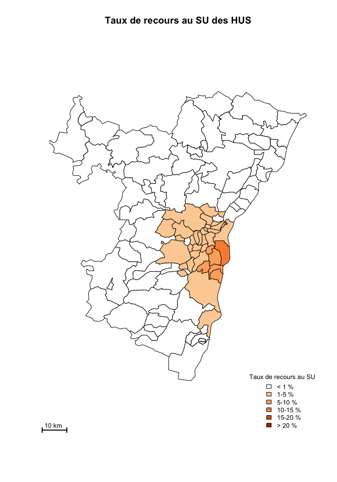
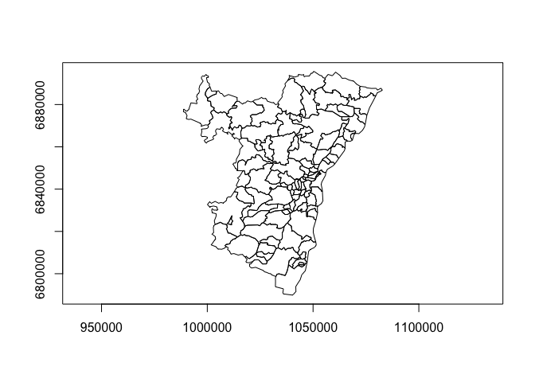
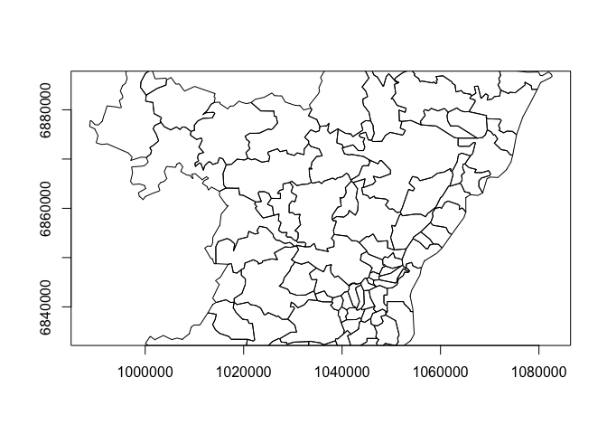
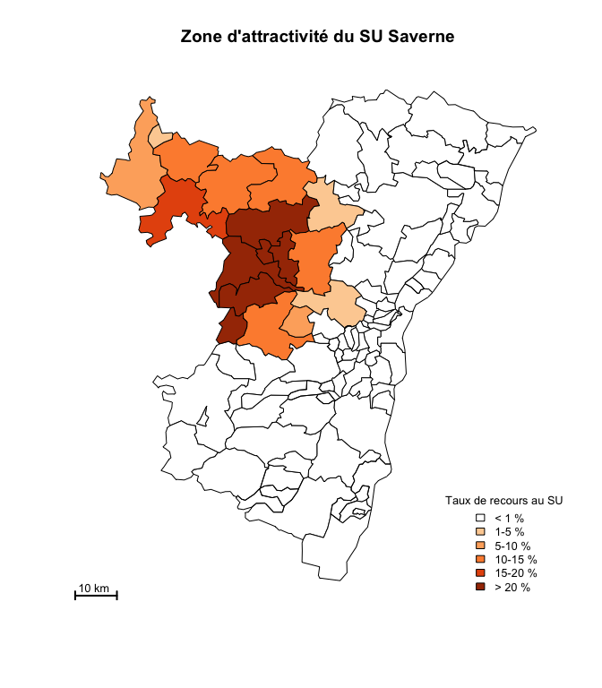
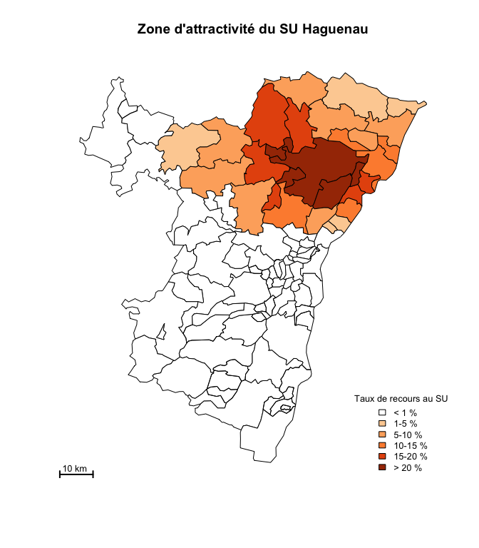
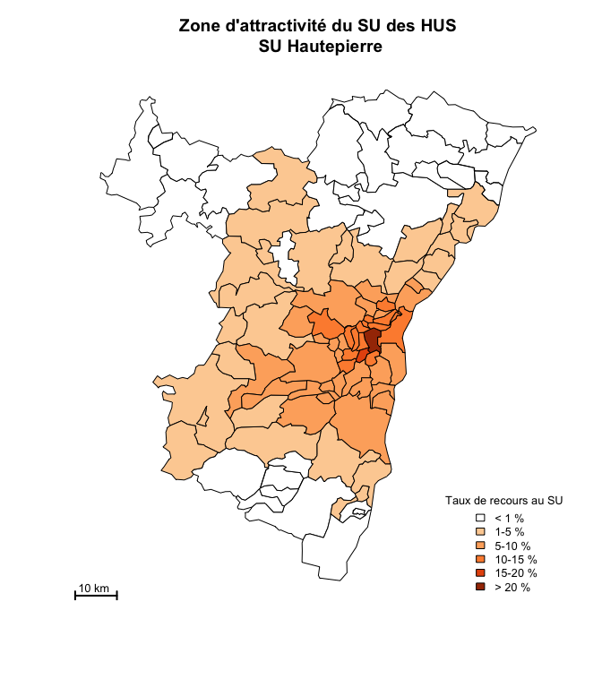
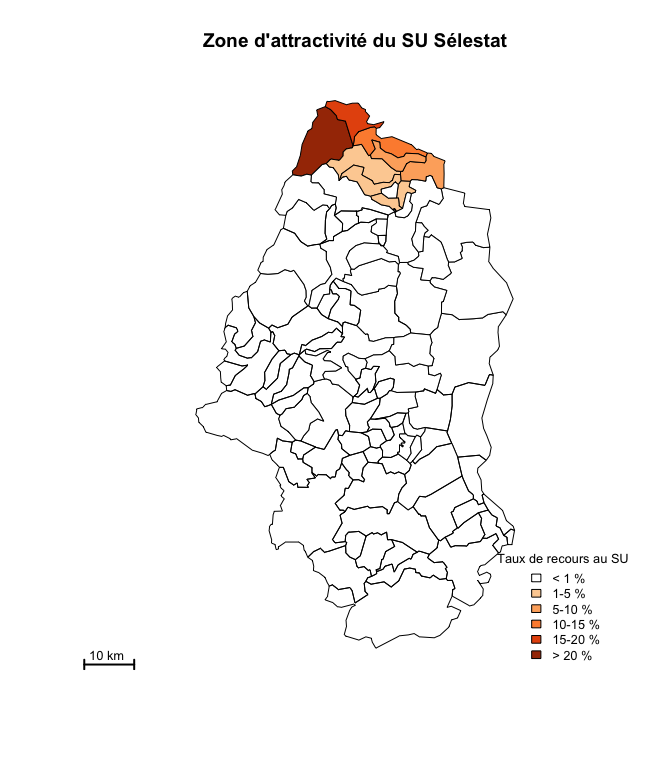

# Zone de chalandise
jcb  
12 juillet 2015  
La zone de chalandise (ZC) est la zone d'attractivité d'un établissement de santé. Elle est définie à partir de la commune de résidence ou du code postal contenu dans chaque RPU. On peut la comparer au bassin de vie définit par l'INSEE.


L'objet est de représenter graphiquement les zones de provenance des patients consultants aux urgences. Le premier découpage utilisé sont les zones définies par les codes postaux, indication figurant dans le RPU. On dispose d'un fichier Shapefile représentant les zones de CP pour toute la France (source Open Date). A partir de ce fichier ont été crées:

- __cp67.Rda__ shapefile pour le bas-Rhin
- __cp68.Rda__ shapefile pour le haut-Rhin
- __cp.alsace.Rda__ shapefile pour l'Alsace

Voir __carto&pop.Rmd__, paragraphe _Codes Postaux_ pour les détails de la création des fichiers shapefile.

Codes postaux d'Alsace
=======================

Bas-Rhin
--------
La base de données attachée au fichier donne les indications suivantes:


```
## [1] "ID"      "LIB"     "DEP"     "SURF"    "POP2010" "X_COL6"
```

- ID: code postal
- LIB: libellé su CP (nom de la commune)
- DEP: n° du département
- SURF: surface de la zone
- POP2010: population 2010
- X_COL6: nombre de ménages

On peut calculer un __Taux de Recours__: nombre de passages dans les structures d'urgence de la zone de patients originaires d'une zone donnée divisé par la population estimée de la même zone sur une période donnée.

Il faut donc connaître le nombre de RPU enregistré durant la période pour une zone donnée.

Ici la zone est l'aire couverte par le code postal (CP).

Haut-Rhin
---------


Alsace
-------


Récupération de RPU créés
=========================
Le nombre de RPU pour un CP peut être extrait de la base RPU.


Liste des CP et des RPU
-----------------------

On forme cp.hus, un dataframe à 2 colonnes (CP, RPU) contenant le nombre de RPU pour un code postal donné résultant d'une consutation aux HUS. On a nrow(cp.hus) = 100 => les RPU des HUS en 2014 proviennent de 100 zones postales différentes.

L'objectif est de pouvoir réaliser une jointure (merge) entre cette matrice et data.cp pour disposer d'une table attributaire permettant d'effectuer des calculs entre des données RPU et des données géographiques (comme calculer la taux de recours).

La fonction __chalandise__ permet de créer ce dataframe.

```
     CP   RPU
1 67100 10843
2 67000  2945
3 67200  2194
4 67400  1650
5 67380   640
6 67540   574
```

Jointure cp67 et FINESS
------------------------
On réalise un merging entre __data.cp__ et __cp.hus__ grace à la méthode __attrbJoin__ qui utilise _match_ à la place de _merge_ (la fonction _merge_ ne conserve pas toujours l'ordre des lignes.)

Note: la jointure ne concerne que la table attributaire (cp67@data) qui se voit ajouter les colonnes RPU et CP (la colonne CP est redondante avec la colonne ID).


Calcul des taux de recours
--------------------------
La table attributaire possède 2 colonnes, POP2010 pour la population de la zone du code postal et RPU contenant le nombre de personnes de la zone ayant eu recours au SU du secteur. Le rapport des deux fournit le taux de recours qui est stoké dans une colonne supplémentaire de la table attributaire.

Le programme affiche en jaune les zones où au moins 1 patient à eu recours au SU de la zone et un chiffre correspondant au taux de recours.


```
    Min.  1st Qu.   Median     Mean  3rd Qu.     Max.     NA's 
0.000264 0.001433 0.004810 0.014040 0.018190 0.136400        8 
```


Cartographie selon le taux de recours
=====================================

Le programme affiche une carte où les CP sont coloriés avec une échelle de couleur progressive en fonction du taux de recours.

L'échelle de couleur est crée à partir de la librairie __RColorBrewer__ sur la base d'une palette de neuf nuances.

Les taux de recours sont discrédités en 5 niveaux pour rester compatible avec les cartes ORUCA. Cependant il n'a pas été possible de conserver leur niveaux de découpage, le taux de recours en Alsace ne dépassant pas 25%.


```
## [1] 100
```



Modifier le zoom de la carte
----------------------------

La carte d'un département est caractérisée par un rectangle englobant dont les dimensions sont stockées sous forme de _matrice_ dans le slot _bbox_. Par défaut le rectangle d'impression est limit par la bbox. Pour aggrandir une image, il suffit de réduire les dimensions du rectangle englobant.

```r
bbox <- cp67@bbox
a <- cp67@bbox
plot(cp67, axes = TRUE)
```



```r
a
```

```
##       min     max
## x  988703 1082671
## y 6789870 6895581
```

```r
b <- matrix(c(988703, 1082671, 6840000, 6880000), nrow = 2, byrow = T)
cp67@bbox <- b
plot(cp67, axes = TRUE)
```



```r
cp67@bbox <- bbox
```


Utilisation des fonctions de zone_chalandise.R
----------------------------------------------


```r
hop <- "Sav"
cp.hop <- chalandise(d14, "CODE_POSTAL", hop)
cp.rpu.hop <- attribJoin(df = cp.hop, spdf = cp67, df.field = "CP", spdf.field = "ID")
carte.recours(cp.rpu.hop, titre = "Zone d'attractivité du SU Saverne")
```




```r
hop <- "Hag"
cp.hop <- chalandise(d14, "CODE_POSTAL", hop)
cp.rpu.hop <- attribJoin(df = cp.hop, spdf = cp67, df.field = "CP", spdf.field = "ID")
carte.recours(cp.rpu.hop, titre = "Zone d'attractivité du SU Haguenau")
```




```r
hop <- "Wis"
cp.hop <- chalandise(d14, "CODE_POSTAL", hop)
cp.rpu.hop <- attribJoin(df = cp.hop, spdf = cp67, df.field = "CP", spdf.field = "ID")
carte.recours(cp.rpu.hop, titre = "Zone d'attractivité du SU Wissembourg")
```


```r
hop <- "HTP"
cp.hop <- chalandise(d14, "CODE_POSTAL", hop)
cp.rpu.hop <- attribJoin(df = cp.hop, spdf = cp67, df.field = "CP", spdf.field = "ID")
carte.recours(cp.rpu.hop, titre = "Zone d'attractivité du SU des HUS\n SU Hautepierre")
```




```r
hop <- "NHC"
cp.hop <- chalandise(d14, "CODE_POSTAL", hop)
cp.rpu.hop <- attribJoin(df = cp.hop, spdf = cp67, df.field = "CP", spdf.field = "ID")
carte.recours(cp.rpu.hop, titre = "Zone d'attractivité du SU des HUS\n SU NHC")
```


```r
hop <- "Hus"
cp.hop <- chalandise(d14, "CODE_POSTAL", hop)
cp.rpu.hop <- attribJoin(df = cp.hop, spdf = cp67, df.field = "CP", spdf.field = "ID")
carte.recours(cp.rpu.hop, titre = "Zone d'attractivité du SU des HUS")
```


```r
hop <- "Ane"
cp.hop <- chalandise(d14, "CODE_POSTAL", hop)
cp.rpu.hop <- attribJoin(df = cp.hop, spdf = cp67, df.field = "CP", spdf.field = "ID")
carte.recours(cp.rpu.hop, titre = "Zone d'attractivité du SU Sainte Anne")
```


```r
hop <- "Odi"
cp.hop <- chalandise(d14, "CODE_POSTAL", hop)
cp.rpu.hop <- attribJoin(df = cp.hop, spdf = cp67, df.field = "CP", spdf.field = "ID")
carte.recours(cp.rpu.hop, titre = "Zone d'attractivité du SU Ste Odile")
```


```r
hop <- "Dts"
cp.hop <- chalandise(d14, "CODE_POSTAL", hop)
cp.rpu.hop <- attribJoin(df = cp.hop, spdf = cp67, df.field = "CP", spdf.field = "ID")
carte.recours(cp.rpu.hop, titre = "Zone d'attractivité SOS Mains Diaconat")
```


```r
hop <- "Sel"
cp.hop <- chalandise(d14, "CODE_POSTAL", hop)
cp.rpu.hop <- attribJoin(df = cp.hop, spdf = cp67, df.field = "CP", spdf.field = "ID")
carte.recours(cp.rpu.hop, titre = "Zone d'attractivité du SU Sélestat")
```


```r
hop <- "Sel"
cp.hop <- chalandise(d14, "CODE_POSTAL", hop)
cp.rpu.hop <- attribJoin(df = cp.hop, spdf = cp68, df.field = "CP", spdf.field = "ID")
carte.recours(cp.rpu.hop, titre = "Zone d'attractivité du SU Sélestat")
```




```r
hop <- "Col"
cp.hop <- chalandise(d14, "CODE_POSTAL", hop)
cp.rpu.hop <- attribJoin(df = cp.hop, spdf = cp68, df.field = "CP", spdf.field = "ID")
carte.recours(cp.rpu.hop, titre = "Zone d'attractivité du SU Colmar")
```


```r
hop <- "Col"
cp.hop <- chalandise(d14, "CODE_POSTAL", hop)
cp.rpu.hop <- attribJoin(df = cp.hop, spdf = cp67, df.field = "CP", spdf.field = "ID")
carte.recours(cp.rpu.hop, titre = "Zone d'attractivité du SU Colmar")
```


```r
hop <- "Geb"
cp.hop <- chalandise(d14, "CODE_POSTAL", hop)
cp.rpu.hop <- attribJoin(df = cp.hop, spdf = cp68, df.field = "CP", spdf.field = "ID")
carte.recours(cp.rpu.hop, titre = "Zone d'attractivité du SU Guebwiller")
```


```r
hop <- "Alk"
cp.hop <- chalandise(d14, "CODE_POSTAL", hop)
cp.rpu.hop <- attribJoin(df = cp.hop, spdf = cp68, df.field = "CP", spdf.field = "ID")
carte.recours(cp.rpu.hop, titre = "Zone d'attractivité du SU Altkirch")
```


```r
hop <- "3Fr"
cp.hop <- chalandise(d14, "CODE_POSTAL", hop)
cp.rpu.hop <- attribJoin(df = cp.hop, spdf = cp68, df.field = "CP", spdf.field = "ID")
carte.recours(cp.rpu.hop, titre = "Zone d'attractivité du SU ST Louis")
```


```r
hop <- "Mul"
cp.hop <- chalandise(d14, "CODE_POSTAL", hop)
cp.rpu.hop <- attribJoin(df = cp.hop, spdf = cp68, df.field = "CP", spdf.field = "ID")
carte.recours(cp.rpu.hop, titre = "Zone d'attractivité du SU Mulhouse")
```


```r
hop <- "Dia"
cp.hop <- chalandise(d14, "CODE_POSTAL", hop)
cp.rpu.hop <- attribJoin(df = cp.hop, spdf = cp68, df.field = "CP", spdf.field = "ID")
carte.recours(cp.rpu.hop, titre = "Zone d'attractivité du SU Diaconat-Fonderie")
```


```r
hop <- "Ros"
cp.hop <- chalandise(d14, "CODE_POSTAL", hop)
cp.rpu.hop <- attribJoin(df = cp.hop, spdf = cp68, df.field = "CP", spdf.field = "ID")
carte.recours(cp.rpu.hop, titre = "Zone d'attractivité du SU Diaconat-Roosvelt")
```


```r
# affiche la carte des CP
plot(cp67)
```


```r
a <- names(cp.hus)

# colorie les CP en rouge si ont consultés les HUS
plot(cp67, col = ifelse(cp67$ID %in% a, "red", "white"))
```


Dessiner avec des nuances de couleur selon la fréquentation


```r
# # palette de 5 couleurs
# greypal <- heat.colors(5)
# # découpage en quintiles
# q <- quantile(cp.hus$RPU, probs = seq(0, 1, 0.2), names = TRUE)
# head(q)
# q2 <- as.character(cut(cp.hus$RPU, breaks = q, labels = greypal, include.lowest = TRUE, right = FALSE))
# plot(cp67, col = ifelse(cp67$ID %in% a, q2, "white"))
```

Fusion des CP
=============


```
## Checking rgeos availability: TRUE
```


Récupérer les coordonnées des polygones
=======================================

La méthode __coordinates__ récupère les coordonées des opjets contenus dans l'objet spatial.


```
## [1] "V1" "V2"
```

```
##           V1      V2
## 2538 1046575 6846231
## 2787 1039915 6882911
## 2788 1039045 6840790
## 2789 1040266 6832372
## 2790 1049302 6830794
## 2791 1049845 6828381
```

Coordonnées du rectangle englobant
==================================

La méthode __bbox__ retourne une matrice carrée contenant les coordonnées des 4 points limitant le rectangle englobant la carte.


```
##       min     max
## x  988703 1082671
## y 6789870 6895581
```

Cartes de base à mettre en stock
=================================

- codes postaux
- communes, cantons, arrondissements
- chef-lieux, préfectures, sous-préfectures
- hopitaux, SAMU, SMUR, Hélismur, SMUR pédiatriques => cartographie de l'offre de soins
- zones de proximité
- territoires de santé
