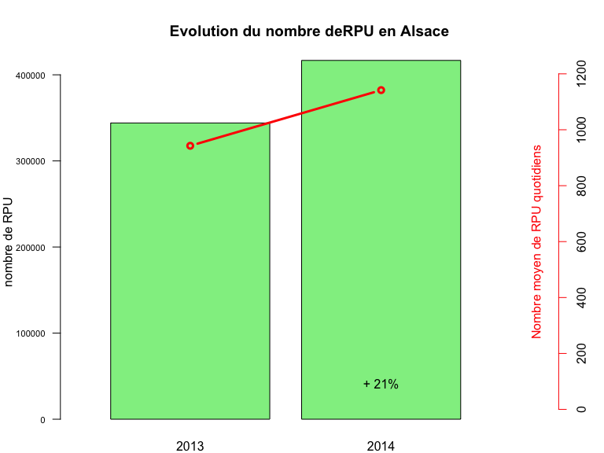

# Rapport 2014 - version FEDORU
JcB  
28/01/2015  

Rapport 2014 respectant les préconisations de la FEDORU
=======================================================

La proposition ici se fait autour de 4 points (représentant chacun une partie de rapport) :


le ‘préambule’ 
==============
    
    En préalable à des résultats d’activité, cette partie peut donner un panorama de l’offre de soins en local, une description des dispositifs de remontées de données, une présentation d’actualités, mais doit surtout faire un point sur les données utilisées (suivi qualitatif et quantitatif).

a. Cartographie l’offre de soins (positionner les SU, SMUR) +/- organisation des soins (ex : PDSA)

b. Possibilité de rappeler quelques éléments de contexte démographique régional et les chiffres clés de la santé en région

c. Point sur le fonctionnement du concentrateur régional : organisation, flux de données (schéma type ?)

i. Exhaustivité des données urgences 

- Nombre de SU transmettant des données / Nombre total de SU
- Nombre total de RPU / Nb total de passages SRVA
- Nombre total de RPU / Nb total de passages SAE (suivant disponibilité)

ii. Qualité des données urgences

- Nombre de logiciel différents utilisés dans la région.
- Graphique en araignée du taux de complétude (% donnée manquante) (après correction données aberrantes) des variables RPU, au moins sexe, âge, durée séjour, ccmu, orientation, code diag principal, motif de recours.
- Critères de cohérences :
    - % CCMU 4 et 5 sortie externe.
- % Diagnostic hors thésaurus SFMU
- % âge > 18 ans dans SU pédiatriques.
- % diag féminin chez homme et inverse

d.      Les travaux de la FEDORU et les travaux nationaux

le tableau récapitulatif dénommé “Chiffres clefs”
=================================================
    
Parfois en début de rapport, parfois en fin, c’est une partie courte et synthétique présentant, sous forme de chiffres clefs, les grands déterminants de l'activité. Choix d’un titre commun. 

__CORE [C]__ obligatoire __SUPPLEMENTAL [S]__ facultatif

## Nombre de SU 
(nombre de SU pédiatriques, nombre de SU polyvalents, nombre SU adultes) [C]

## Nombre de SU publics / privés [C]

## Nombre de passages dans l'année [C]

416 733

## Moyenne quotidienne de passages [C]

1 141.734

## %(N) d'évolution par rapport à année N-1 [C]

## %(N) public/privé [C]


## %(N) Femme [C]

47.78 % (199 110)

## %(N) Homme [C]

52.22 % (217 617)


## % (N) < 1 an [C]
15376 (3.69 %)

## %(N) < 18 ans [C]
119213 (28.61 %)

## %(N) >= 75 ans [C]
57271 (13.74 %)

## Age moyen

- age moyen[C]: 38.03 ans.

- age moyen des hommes [S] (pourquoi 'homme et femme' en SUPP ?) NA ans.
- age moyen des femmes [S] 40.31 ans.

## Taux de recours (définition FEDORU) régional aux urgences. [S]
Utilisation des données INSEE qui collent le plus à la période d’étude (projections ou données consolidées)


## % sur activité les jours de  WE [S]
= ((Nbsam+NbDim/2)-(sommeNbJourSEm/5))/ ((Nbsam+NbDim/2)*100

4.52 % d'activité supplémentaire le WE.

NB: le calcul ne tient pas compte des jours fériés (à faire).

## % du delta entre mois le plus chargé et le mois le moins chargé [S]

71.4142648 %


## % passages nuit (définition FEDORU) [C]
nombre de passages dont l’admission s’est effectuée sur la période [20h00 - 7h59] divisé par l’ensemble des passages

24.74 % (N = 92610)

## % passages nuit profonde (définition FEDORU) [C]
nombre de passages dont l’admission s’est effectuée sur la période [00h00 - 7h59] divisé par l’ensemble des passages

11.09 % (N = 41500)


##  %(N) d'arrivée perso [S]

72.16 % (N = 208 771)

##  %(N) d'arrivée SMUR [S]

0.93 % (N = 2 702)

##  %(N) d'arrivée VSAB [S]

10.35 % (N = 29 954)

##  %(N) d'arrivée Ambulance [S]

15.94 % (N = 46 112)


##  %(N) CCMU 1 et 2 [C]
84.45% (n = 286979)

##  %(N) CCMU 4 et 5 [C]
1.28% (n = 4341)

##  %(N) Médico-chir [C]

##  %(N) Traumato [C]

##  %(N) Psy [C]
0.38% (n = 1307)

## Durée de séjour (hors UHCD): 
moyenne +/- ET ; médiane (IQR) [C]

- moyenne: 154.9 mn
- écart-type: 171.5908609 mn
- médiane: 109 mn
- IQR: 146 mn

###  % (N) passages ayant durée attente > 1 heure [S]
Pas calculable en Alsace :-(

###  %  (N) passages durée séjour > 4h [S]
18.69% (n = 69521)


##  %  (N)Externe [C]

75.5 % (N = 255 852)

##  %  (N)Hospitalisation [C]

22.72 % (N = 76 999)

##  %  (N)Transfert [C]

1.78 % (N = 6 025)

##  %  (N)Sortie non convenue [C]

5.09 % (N = 4 222)

##  %  (N)Décès [C]
0.01% (n = 26)

les résultats régionaux (page 10)
=======================

partie centrale du rapport dans laquelle tous les résultats d’activité sont présentés dans le déroulement d’une trame. Le principe est de passer en revue les variables du RPU (communes à tous normalement), d’en proposer une exploitation si elles présentent un intérêt, puis de proposer quelques croisements associés à chaque variable s’ils semblent pertinents (présence d’un bloc ‘croisement’ spécifique dans chaque partie ci dessous).

Volume global d’activité, cumul de passages
-------------------------------------------

#### historique du nombre de passages

#### [1][2] par année et de la moyenne quotidienne du nombre de passages

Graphe avec 2 axes des abcisses:

- total par année
- moyenne quotidienne par année

 

- nombre de passages en 2014: 416 733 soit en moyenne 1142 par jour.

#### [3] % d’augmentation annuelle sur les années disponibles


% de variation 2014/2013 = 21.12 %

croisements :

#### [4][5] nombre de passages et % par type de structures (CH, CHU, privé), année N

```
     2014         %           
CH   "282 036.00" "     67.68"
CHU  " 61 793.00" "     14.83"
PSPH " 72 867.00" "     17.49"
     "416 696.00" "    100.00"
```
#### [6] % CH, CHU, privé sur les années disponibles

Caractéristique des patients : âge
-----------------------------------

- [7][8] moyenne âge +/- écart type année N
- [9] répartition par tranche âge
- [10] pyramide des âges des patients accueillis aux urgences année N
- croisements : 
- [11] sexe-moyenne âge femme/homme, année N
- [12] proportion des âge extrêmes (moins de 1 an, plus de 90 ans) par mois, année N

Caractéristique des patients : sexe
------------------------------------

- [13] répartition en fonction du sexe année N 
- [14] sex ratio, année N
- croisements :
- [15] sex ratio H/F par classe d’âge, année N
- [16] taux de masculinité

Provenance géographique des patients
------------------------------------

- provenance région / hors région / étranger, année N
- cartographie des pourcentages d’activité que représentent les passages de patients provenant des départements limitrophes, année N
- cartographie du nombre de passages régional en fonction du lieu de résidence du patient (code postal) année N
- pourcentage de patient ne résidant pas dans une zone postale où est installée une structure d’urgence, année N

croisements :

- cartographie des taux de recours année N
- taux de recours / âge et / sexe, année N
- évolution par mois des moyennes quotidiennes de passages des populations région / hors région / étranger, année N

Arrivée aux urgences
--------------------

- Moyenne quotidienne du nombre de passages par mois (basée sur la date d’admission) année N
- Nombre de passages par semaine (basée sur la date d’admission) année N (positionner les vacances scolaires de la zone concernée)
- Moyenne quotidienne du nombre de passages par jour de semaine (basée sur la date d’admission), année N
- Répartition semaine/week-end (basée sur la date d’admission), année N
- Moyenne quotidienne du nombre de passages par « tranche d’heure » d’entrée , année N
- Pourcentage du nombre de passages par heure d’entrée et de sortie, année N
- Répartition jour/nuit (%), année N
- Nombre de passages et % réalisés durant les horaires PDS

croisements :

- Différentiel d’activité en % été/hiver (pourcentage de variation du nombre de passages entre l’été (ou l’hiver) et le reste de l’année) par - - type de SU (adulte, pédia, polyvalent)
- % de catégorie d’âge (pédia, âge moyen, géria) en fonction de la tranche d’heure d’entrée, année N
- % de classe d’âge (pédia, âge moyen, géria) en fonction de l’heure d’entrée, année N
- Taux d’hospitalisation et taux de retour à domicile en fonction de l’heure d’entrée, année N
- % du type de recours (trauma, psy, medico chir) en fonction de l’heure d’entrée, année N
- % du mode de transport à l’entrée (VSAV, SMUR, AP,…) en fonction de l’heure d’entrée, année N
- Moyenne quotidienne du nombre de passages par semaine, (basée sur la date d’admission) en fonction du type de SU (polyvalent, pédia, adulte), année N

Mode de transport à l’arrivée aux urgences
------------------------------------------

- Répartition des modes de transport (à l’arrivée aux urgences), année N, évolution

croisements :

- Mode de transport (à l’arrivée aux urgences) par département
- Mode de transport (à l’arrivée aux urgences) par type de structure (CH, CHU, privé)
- Mode de transport (à l’arrivée aux urgences) par tranche d'âge
- Mode de transport (à l’arrivée aux urgences) par CCMU regroupé ([1;2] ; 3 ; [4;5])

Gravité
-------
    
    - répartition CCMU par regroupement ([1;2] ; 3 ; [4;5]; D; P), année N

croisements :
    
    - pourcentage de CCMU 1 et 2? par tranche d'âge, année N
- pourcentage de CCMU 4 et 5 par tranche d'âge, année N

Motif de recours
----------------
    
    - Nombre de passages par motif, année N 

Pathologie
----------
    
    - répartition par type d’urgences (med/chir, traumato, psy, toxico, autre), année N
- répartition par entêtes chapitre CIM 10, année N
- répartition par disciplines, année N
- répartition par diagnostic principal (top 10), année N
- répartition par diagnostic principal (top 5) en fonction du type d’urgences (med/chir, traumato, psy, toxico, autre), année N

croisements :
    
    - Type d’urgences (med/chir, traumato, psy, toxico, autre) en fonction de la classe d’âge (pédia, âge moyen, géria), année N
- TOP 10 diagnostic principal en fonction du sexe, année N 

Temps de passage
----------------
    
    - Temps de passage moyen +/- ET et médian (IQR), année N
- Répartition des passages par durée de passage en classe
- Pourcentage cumulé des temps de passage, année N

Croisements :
    
    - Temps de passage médian en fonction de la classe d’âge (pédia, âge moyen, géria), année N
- Temps de passage médian par type de structure (CH, CHU, privé), année N
- Temps de passage médian par type de SU (polyvalent / ped/ adulte), année N
- Temps de passage médian selon catégories de nombre de passage annuel dans les SU, année N
- Temps de passage médian en fonction du mode d'entrée année N
- Temps de passage médian en fonction de CCMU (CCMU1, CCMU4&5), année N
- Temps de passage médian en fonction du sexe, année N
- Temps de passage médian en fonction du type d’urgences (med/chir, traumato, psy, toxico, autre), année N
- TOP 10 diagnostic principal pour lequel le temps de passage médian est le plus long / le plus court, année N
- Temps de passage médian en fonction de l’orientation du patient, année N 
- Temps de passage médian en fonction de l’heure d’entrée et de l’heure de sortie, année N

Orientation
-----------

- Moyenne quotidienne du nombre de passages en fonction de l’orientation, année N 

croisements :

- Moyenne quotidienne dunombre d’hospitalisations en fonction de la classe d’âge (pédia, âge moyen, géria), année N
- Taux d’hospitalisation en fonction de jour/nuit et âge, année N
- Top 5 des disciplines pathologiques pour lesquelles le taux d’hospitalisation est le plus fort, année N
- Top 5 des disciplines pathologiques pour lesquelles le taux de retour à domicile est le plus fort, année N
- Cartographie du taux de retour à domicile en fonction du lieu de résidence du patient (code postal) année N
- Nombre de décès par semaine, année N

les analyses par filière
------------------------

focus sur une sous déclinaison de l’activité (pathologies traceuses ou traits caractéristiques de la patientèle)

#### AVC : (définition FEDORU)

- Nombre de passages AVC urgences, année N
- Nombre de passages AVC urgences, déclinaison par département, établissement, année N
- Moyenne quotidienne, année N
- Age moyen, année N
- Répartition par classe âge en pourcentage, année N
- Répartition par sexe en pourcentage, année N
- TOP 5 pourcentage par code CIM 10, année N
- Répartition we/semaine en pourcentage, année N
- Répartition par tranche heure en pourcentage, année N
- Répartition par orientation en pourcentage, année N
- Temps de passage médian, année N

Définitions FEDORU
====================

taux de recours (de la région ou département)
---------------------------------------------
nombre de passages dans les services d’urgences (de la région ou département) de patients résidant dans une zone donnée (code postal ou commune) divisé par la population estimée de cette zone sur la pérriode donnée.

pourcentage de passage nuit
---------------------------
nombre de passages dont l’admission s’est effectuée sur la période [20h00 - 7h59] divisé par l’ensemble des passages

pourcentage de passage nuit profonde
------------------------------------
nombre de passages dont l’admission s’est effectuée sur la période [00h00 - 7h59] divisé par l’ensemble des passages

tranche d’âge
-------------
```{}
<28j;[28j-1A[;[1-5[;[5-10[;[10-15[;[15-18[;[18-30[;[30-45[;[45;65[;[65-75[;[75;85[;>85ans
```

sexe
-----
M/F/I

« tranche d’heure » d’entrée
----------------------------
matinée [8h00-11h59] ; début d’après midi [12h00-15h59] ; fin d’après midi [16h00-19h59] ; soirée [20h00-23h59] ; nuit profonde [00h00;07h59]

horaire PDS
------------

- week end PDSA: du samedi 12h00 au lundi 07h59
- en semaine: du lundi au vendredi de [20h00 - 07h59] le lendemain
- jour férié: de 00h00 à 23h59
- pont PDSA: de 00h00 à 23h59

Les ponts PDSA sont ceux qui sont qualifiés comme tel par l’ARS et qui génère à ce titre le mise en place d’une régulation PDSA sur cette période. Si un pont PDSA, ou un jour férié survient un vendredi, le samedi matin suivant sera dès lors intégré à l’activité PDSA.

durée de passage en classe
--------------------------
2 types de regroupements :

- moins de 4 heures ; 4 heures et plus
- moins d’une heure ; entre 1 et 2 heures ; de 2 à 4 heures ; de 4 à 8 heures ; de 8 à 12 heures ; entre 12 et 72 heures ; (bornes supérieures exclues)


