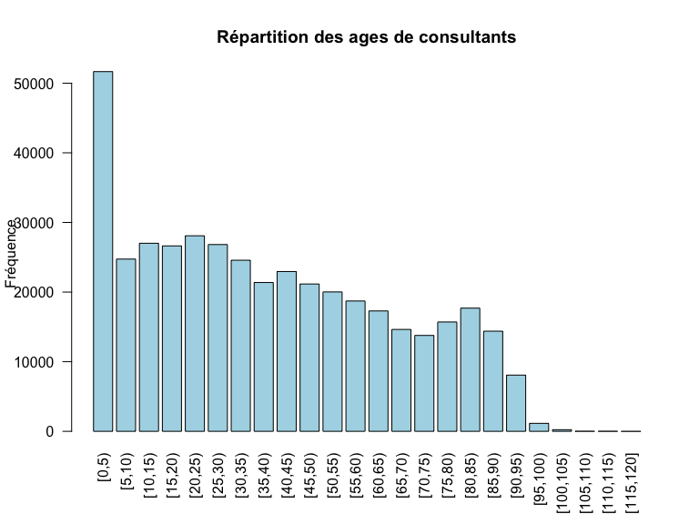
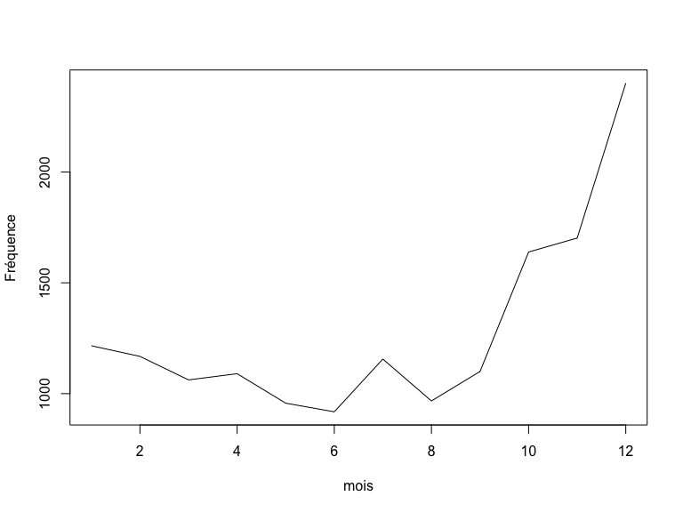
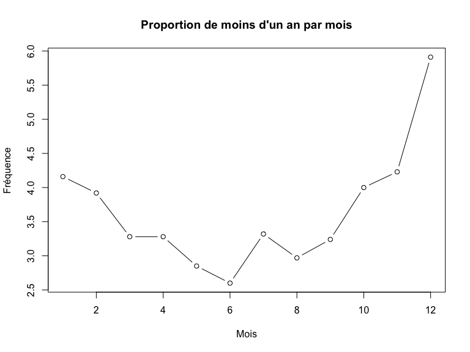
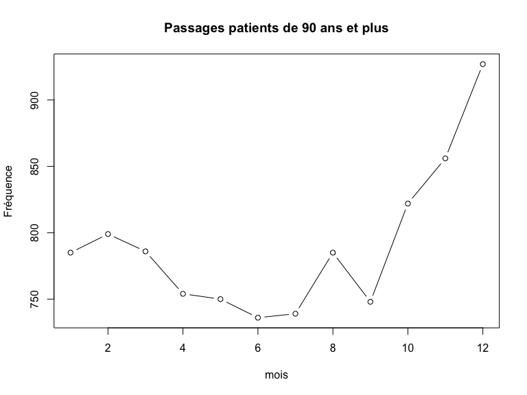
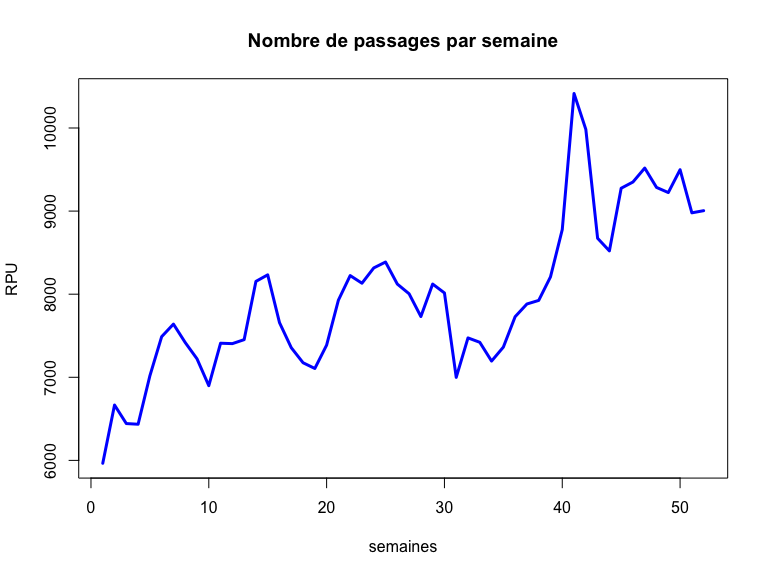
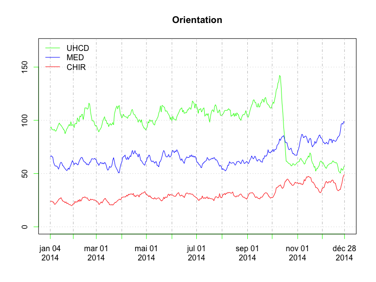
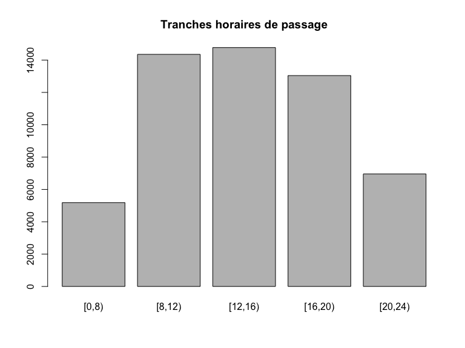

# Rapport 2014 - version FEDORU
JcB  
28/01/2015  

Rapport 2014 respectant les préconisations de la FEDORU
=======================================================

[Trame commune](https://docs.google.com/document/d/101LYVqVLeHZnrujfMm3aqBYfbOwx3CPEB3Y-Lbud2Ls/edit)

Le document de référence pour le rapport est: __V4 trame commune 2014 rapport inter région__ (xps: /home/jcb/Documents/Resural/FEDORU/Trame_Commune/DOC/Trame commune 2014 rapport inter région (V4).docx)

Titre: __Activité des structures d’urgences : panorama 2014 de la région Alsace__

___NOTE__: certaines informations utiles sont dans __RPU_Doc__.


La proposition ici se fait autour de 4 points (représentant chacun une partie de rapport) :

le ‘préambule’ 
==============
    
    En préalable à des résultats d’activité, cette partie peut donner un panorama de l’offre de soins en local, une description des dispositifs de remontées de données, une présentation d’actualités, mais doit surtout faire un point sur les données utilisées (suivi qualitatif et quantitatif).

a. Cartographie l’offre de soins (positionner les SU, SMUR) +/- organisation des soins (ex : PDSA)

b. Possibilité de rappeler quelques éléments de contexte démographique régional et les chiffres clés de la santé en région

c. Point sur le fonctionnement du concentrateur régional : organisation, flux de données (schéma type ?)

i. Exhaustivité des données urgences 

- Nombre de SU transmettant des données / Nombre total de SU

#### nombre de SU transmettants des RPU: 15
#### nombre de SU ne transmettant pas: 1
#### taux d'exhaustivité: 94 %

- Nombre total de RPU / Nb total de passages SRVA (Serveur de veille et d'alerte)

#### Nombre total de RPU / Nb total de passages SAE (Statistique annuelle des établissements de santé) (suivant disponibilité): 8,2 % (NOTE le nombre de passages déclarés est celui indiqué par les données SAE 2013)

#### Exhaustivité quantitative régionale (NB de RPU/Nb de passages x Nb SU transmettant des RPU/Nb total SU): 7.7 %.

ii. Qualité des données urgences

- Nombre de logiciel différents utilisés dans la région.

- Graphique en araignée du taux de complétude (% donnée manquante) (après correction données aberrantes) des variables RPU, au moins sexe, âge, durée séjour, ccmu, orientation, code diag principal, motif de recours.

  


- Critères de cohérence :

- % CCMU 4 et 5 sortie externe.


#### 0.12

#### % de CCMU 4 et 5 renvoyé à domicile: 0.12 %

    - % Diagnostic hors thésaurus SFMU
    - % âge > 18 ans dans SU pédiatriques.
    - % diag féminin chez homme et inverse


d.      Les travaux de la FEDORU et les travaux nationaux

le tableau récapitulatif dénommé “Chiffres clefs”
=================================================
    
Parfois en début de rapport, parfois en fin, c’est une partie courte et synthétique présentant, sous forme de chiffres clefs, les grands déterminants de l'activité. Choix d’un titre commun. 

__CORE [C]__ obligatoire __SUPPLEMENTAL [S]__ facultatif


Analyse sur la période:

- du 2015-01-01
- au 2015-01-31
- soit 31 jours

## Nombre de SU 
(nombre de SU pédiatriques, nombre de SU polyvalents, nombre SU adultes) [C]

- Nombre de SU: 16

### Nombre de SU publics / privés [C]

- nombre de SU dans le secteur public: 12
- nombre de SU dans le secteur privé: 4

## Recueil des données

sur 2 colonnes : 

- à partir des RPU transmis si exhaustif sinon à partir des données SRVA
- à partir des données SAE


- Nombre de passages dans l'année [C]: 40 509 RPU
- Moyenne quotidienne de passages [C]: 1 307 RPU
- %(N) d'évolution par rapport à année N-1 [C]: 12 %.
- % d’évolution moyenne sur les 5 dernières années (méthode calcul : moyenne des évolutions constatées entre chaque année)
- Données renseignées (données à partir desquelles tout le reste de l’analyse sera effectuée)
    - Nombre de RPU transmis: 40 509 RPU
    - Exhaustivité du recueil : Nb RPU transmis / Nb de passages déclarés 8,2 % (NOTE le nombre de passages déclarés est celui indiqué par les données SAE 2013)


## %(N) public/privé [C]

Possiblement polémique. Pour l'instant on décide de ne pas le mettre.


- nombre de RPU publics: 33936 (83.77 %)
- nombre de RPU privés: 6573 (16.23 %)

## SEXE

### %(N) Femme [C]

49.39 % (19 997)

### %(N) Homme [C]

50.61 % (20 488)

## AGE


### % (N) < 1 an [C]
1991 (4.92 %)

### %(N) < 18 ans [C]
12769 (31.52 %)

### %(N) >= 75 ans [C]
5671 (14 %)

### Age moyen

- age moyen[C]: 37.13 ans.

- age moyen des hommes [S] (pourquoi 'homme et femme' en SUPP ?) 35.34 ans.
- age moyen des femmes [S] 38.99 ans.

### Taux de recours (définition FEDORU) régional aux urgences. [S]
Utilisation des données INSEE qui collent le plus à la période d’étude (projections ou données consolidées)


### % sur activité les jours de  WE [S]
= ((Nbsam+NbDim/2)-(sommeNbJourSEm/5))/ ((Nbsam+NbDim/2)*100 [Limousin]

6.35 % d'activité supplémentaire le WE.

NB: le calcul ne tient pas compte des jours fériés (à faire).

## % du delta entre mois le plus chargé et le mois le moins chargé [S]

100 %

Durées de passage
-----------------


- durée moyenne de passage 174 mn.
- écart-type: 173.5 mn.
- médiane: 123 mn.
- nombre de passages > 4 heures: 8465 (23.61 %).

 

```
##       [,1]
##  [1,]  0.7
##  [2,]  1.9
##  [3,]  3.1
##  [4,]  4.3
##  [5,]  5.5
##  [6,]  6.7
##  [7,]  7.9
##  [8,]  9.1
##  [9,] 10.3
## [10,] 11.5
## [11,] 12.7
## [12,] 13.9
## [13,] 15.1
## [14,] 16.3
## [15,] 17.5
## [16,] 18.7
## [17,] 19.9
## [18,] 21.1
## [19,] 22.3
## [20,] 23.5
## [21,] 24.7
## [22,] 25.9
## [23,] 27.1
## [24,] 28.3
```

### % passages nuit (définition FEDORU) [C]
nombre de passages dont l’admission s’est effectuée sur la période [20h00 - 7h59] divisé par l’ensemble des passages

23.61 % (N = 8561)

### % passages nuit profonde (définition FEDORU) [C]
nombre de passages dont l’admission s’est effectuée sur la période [00h00 - 7h59] divisé par l’ensemble des passages

11.27 % (N = 4088)

Mode de transport
-----------------


###  %(N) d'arrivée perso [S]

68.91 % (N = 19 913)

###  %(N) d'arrivée SMUR [S]

1.06 % (N = 305)

###  %(N) d'arrivée VSAB [S]

10.3 % (N = 2 977)

###  %(N) d'arrivée Ambulance [S]

19.13 % (N = 5 527)

Gravité (CCMU)
--------------


###  %(N) CCMU 1 et 2 [C]
84.16% (n = 26549)

###  %(N) CCMU 4 et 5 [C]
1.38% (n = 434)

###  %(N) Médico-chir [C]

###  %(N) Traumato [C]

###  %(N) Psy [C]
0.39% (n = 124)

Durée de présence
-----------------

### Durée de séjour (hors UHCD): 
moyenne +/- ET ; médiane (IQR) [C]

- moyenne: 174 mn
- écart-type: 173.5 mn
- médiane: 123 mn
- IQR: 169 mn

###  % (N) passages ayant durée attente > 1 heure [S]
Pas calculable en Alsace :-(

###  %  (N) passages durée séjour > 4h [S]
23.61% (n = 8465)

Mode de sortie
--------------


###  %  (N)Externe [C]

75.36 % (N = 21 497)

###  %  (N)Hospitalisation [C]

23.1 % (N = 6 590)

###  %  (N)Transfert [C]

1.54 % (N = 439)

###  %  (N)Sortie non convenue [C]

4.58 % (N = 336)

###  %  (N)Décès [C]
0% (n = 1)


les résultats régionaux
========================

partie centrale du rapport dans laquelle tous les résultats d’activité sont présentés dans le déroulement d’une trame. Le principe est de passer en revue les variables du RPU (communes à tous normalement), d’en proposer une exploitation si elles présentent un intérêt, puis de proposer quelques croisements associés à chaque variable s’ils semblent pertinents (présence d’un bloc ‘croisement’ spécifique dans chaque partie ci dessous).

Volume global d’activité, cumul de passages
-------------------------------------------

#### historique du nombre de passages

#### [1][2] par année et de la moyenne quotidienne du nombre de passages

Graphe avec 2 axes des abcisses:

- total par année
- moyenne quotidienne par année

 

- nombre de passages en 2014: 40 509 soit en moyenne 111 par jour.

#### [3] % d’augmentation annuelle sur les années disponibles


% de variation 2014/2013 = -88.23 % 

croisements :

#### [4][5] nombre de passages et % par type de structures (CH, CHU, privé), année N

On  utilise le fichier __Hopitaux_Alsace2.csv__ qui comporte les informations suivantes:

- nom de la structure
- aabréviation pour lesRPU
- FINESS géographique
- FINESS juridique
- Groupe juridique (ex. GHSV)
- Territoire de santé
- Zone de proximité
- type
- statut
- nombre total de lits
- nombre de lits de chirurgie
- nombre de lits de médecine

Le calcul se fait après un merging de dx et de hop.


```
     2014     %       
CH   "30 403" "    47"
CHU  "27 570" "    43"
PSPH " 6 573" "    10"
     "64 546" "   100"
```
#### [6] % CH, CHU, privé sur les années disponibles

Caractéristique des patients : âge
-----------------------------------

- [7][8] moyenne âge +/- écart type année N

moyenne d'age: 37.13 ans, ecart-type: 27.8`ans.

- [9] répartition par tranche âge

```
[1] "ToDo"
```

```
a
    [0,5)    [5,10)   [10,15)   [15,20)   [20,25)   [25,30)   [30,35) 
     5965      2460      2759      2617      2515      2490      2211 
  [35,40)   [40,45)   [45,50)   [50,55)   [55,60)   [60,65)   [65,70) 
     1929      2003      1924      1869      1736      1584      1440 
  [70,75)   [75,80)   [80,85)   [85,90)   [90,95)  [95,100) [100,105) 
     1335      1482      1763      1456       809       138        20 
[105,110) [110,115) [115,120] 
        0         3         0 
```

 

- [10] pyramide des âges des patients accueillis aux urgences année N

 

```
## [1] 5.1 4.1 4.1 2.1
```

- croisements : 

- [11] sexe-moyenne âge femme/homme, année N

```
##  F  I  M 
## 39 16 35
```

- [12] proportion des âge extrêmes (moins de 1 an, plus de 90 ans) par mois, année N

    


Caractéristique des patients : sexe
------------------------------------

- [13] répartition en fonction du sexe année N 

```
## 
##     F     I     M 
## 19997    24 20488
```

- [14] sex ratio, année N

sex-ratio = 1.02

- croisements :

- [15] sex ratio H/F par classe d’âge, année N


```
##     [0,5)    [5,10)   [10,15)   [15,20)   [20,25)   [25,30)   [30,35) 
##     1.276     1.132     0.999     0.885     0.915     1.023     1.166 
##   [35,40)   [40,45)   [45,50)   [50,55)   [55,60)   [60,65)   [65,70) 
##     1.119     1.168     1.191     1.000     1.181     1.152     1.162 
##   [70,75)   [75,80)   [80,85)   [85,90)   [90,95)  [95,100) [100,105) 
##     1.251     0.976     0.685     0.566     0.342     0.211     0.053 
## [105,110) [110,115) [115,120] 
##        NA     2.000        NA
```

 


- [16] taux de masculinité

0.51

Provenance géographique des patients
------------------------------------
- population régionale (INSEE)


- provenance région / hors région / étranger, année N


- cartographie des pourcentages d’activité que représentent les passages de patients provenant des départements limitrophes, année N

- cartographie du nombre de passages régional en fonction du lieu de résidence du patient (code postal) année N

- pourcentage de patient ne résidant pas dans une zone postale où est installée une structure d’urgence, année N

croisements :

- cartographie des taux de recours année N
- taux de recours / âge et / sexe, année N
- évolution par mois des moyennes quotidiennes de passages des populations région / hors région / étranger, année N

Arrivée aux urgences
--------------------

- Moyenne quotidienne du nombre de passages par mois (basée sur la date d’admission) année N
 

- Nombre de passages par semaine (basée sur la date d’admission) année N (positionner les vacances scolaires de la zone concernée)
 

- Moyenne quotidienne du nombre de passages par jour de semaine (basée sur la date d’admission), année N


- Répartition semaine/week-end (basée sur la date d’admission), année N
- Moyenne quotidienne du nombre de passages par « tranche d’heure » d’entrée , année N
- Pourcentage du nombre de passages par heure d’entrée et de sortie, année N
- Répartition jour/nuit (%), année N
- Nombre de passages et % réalisés durant les horaires PDS

croisements :

- Différentiel d’activité en % été/hiver (pourcentage de variation du nombre de passages entre l’été (ou l’hiver) et le reste de l’année) par - - type de SU (adulte, pédia, polyvalent)
- % de catégorie d’âge (pédia, âge moyen, géria) en fonction de la tranche d’heure d’entrée, année N
- % de classe d’âge (pédia, âge moyen, géria) en fonction de l’heure d’entrée, année N
- Taux d’hospitalisation et taux de retour à domicile en fonction de l’heure d’entrée, année N
- % du type de recours (trauma, psy, medico chir) en fonction de l’heure d’entrée, année N
- % du mode de transport à l’entrée (VSAV, SMUR, AP,…) en fonction de l’heure d’entrée, année N
- Moyenne quotidienne du nombre de passages par semaine, (basée sur la date d’admission) en fonction du type de SU (polyvalent, pédia, adulte), année N

Mode de transport à l’arrivée aux urgences
------------------------------------------

- Répartition des modes de transport (à l’arrivée aux urgences), année N, évolution

croisements :

- Mode de transport (à l’arrivée aux urgences) par département
- Mode de transport (à l’arrivée aux urgences) par type de structure (CH, CHU, privé)
- Mode de transport (à l’arrivée aux urgences) par tranche d'âge
- Mode de transport (à l’arrivée aux urgences) par CCMU regroupé ([1;2] ; 3 ; [4;5])

Gravité
-------
    
- répartition CCMU par regroupement ([1;2] ; 3 ; [4;5]; D; P), année N

croisements :
    
- pourcentage de CCMU 1 et 2 par tranche d'âge, année N
- pourcentage de CCMU 4 et 5 par tranche d'âge, année N

Motif de recours
----------------
    
    - Nombre de passages par motif, année N 

Pathologie
----------
    
- répartition par type d’urgences (med/chir, traumato, psy, toxico, autre), année N
- répartition par entêtes chapitre CIM 10, année N
- répartition par disciplines, année N
- répartition par diagnostic principal (top 10), année N
- répartition par diagnostic principal (top 5) en fonction du type d’urgences (med/chir, traumato, psy, toxico, autre), année N

croisements :
    
    - Type d’urgences (med/chir, traumato, psy, toxico, autre) en fonction de la classe d’âge (pédia, âge moyen, géria), année N
- TOP 10 diagnostic principal en fonction du sexe, année N 

Temps de passage
----------------
    
- Temps de passage moyen +/- ET et médian (IQR), année N
- Répartition des passages par durée de passage en classe
- Pourcentage cumulé des temps de passage, année N

Croisements :
    
    - Temps de passage médian en fonction de la classe d’âge (pédia, âge moyen, géria), année N
- Temps de passage médian par type de structure (CH, CHU, privé), année N
- Temps de passage médian par type de SU (polyvalent / ped/ adulte), année N
- Temps de passage médian selon catégories de nombre de passage annuel dans les SU, année N
- Temps de passage médian en fonction du mode d'entrée année N
- Temps de passage médian en fonction de CCMU (CCMU1, CCMU4&5), année N
- Temps de passage médian en fonction du sexe, année N
- Temps de passage médian en fonction du type d’urgences (med/chir, traumato, psy, toxico, autre), année N
- TOP 10 diagnostic principal pour lequel le temps de passage médian est le plus long / le plus court, année N
- Temps de passage médian en fonction de l’orientation du patient, année N 
- Temps de passage médian en fonction de l’heure d’entrée et de l’heure de sortie, année N

Orientation
-----------

- Moyenne quotidienne du nombre de passages en fonction de l’orientation, année N 


```
##  CHIR FUGUE   HDT    HO   MED  OBST   PSA   REA   REO    SC  SCAM    SI 
##  41.5   1.2   1.2   1.0  83.4   1.4   9.3   5.5   4.3   7.4   1.7  12.3 
##  UHCD 
##  70.4
```

```
##  CHIR FUGUE   HDT    HO   MED  OBST   PSA   REA   REO    SC  SCAM    SI 
##  1287    15    15     3  2585    15   289   171   130   229    32   381 
##  UHCD 
##  2181
```

 


croisements :

- Moyenne quotidienne du nombre d’hospitalisations en fonction de la classe d’âge (pédia, âge moyen, géria), année N
- Taux d’hospitalisation en fonction de jour/nuit et âge, année N
- Top 5 des disciplines pathologiques pour lesquelles le taux d’hospitalisation est le plus fort, année N
- Top 5 des disciplines pathologiques pour lesquelles le taux de retour à domicile est le plus fort, année N
- Cartographie du taux de retour à domicile en fonction du lieu de résidence du patient (code postal) année N
- Nombre de décès par semaine, année N

les analyses par filière
------------------------

focus sur une sous déclinaison de l’activité (pathologies traceuses ou traits caractéristiques de la patientèle)

#### AVC : (définition FEDORU)

- Nombre de passages AVC urgences, année N
- Nombre de passages AVC urgences, déclinaison par département, établissement, année N
- Moyenne quotidienne, année N
- Age moyen, année N
- Répartition par classe âge en pourcentage, année N
- Répartition par sexe en pourcentage, année N
- TOP 5 pourcentage par code CIM 10, année N
- Répartition we/semaine en pourcentage, année N
- Répartition par tranche heure en pourcentage, année N
- Répartition par orientation en pourcentage, année N
- Temps de passage médian, année N

Les chiffres clés de l’activité gériatrique des services d’urgences (plus de 75 ans)
====================================================================================

RECUEIL DES DONNÉES
-------------------
- Nombre de passages dans l'année: 5393
- Moyenne quotidienne de passage: 173.97 passages/j
- Taux d'urgences gériatriques (Nb RPU Géria/ Nb RPU global)*100: 13.31 %
- TODO: % d'évolution par rapport à l'année N-1(données SAE pour ceux qui n’ont pas d’historique RPU fiable et permettant la comparaison, préciser l’origine des données)

PATIENTS
--------
 

- Sex ratio: 0.62
- Pyramide des âges (âge par année, borne supérieure toujours exclue)
- Par sous classe d’âge (GT1:2 classes, moins de 85 et 85 ans et plus):

    - Nombre de passages
    - Moyenne quotidienne de passage
    - Sex ratio
    
    

                  effectif   moyenne.j   médiane.j   sex-ratio
---------------  ---------  ----------  ----------  ----------
75-84 ans             2967          96          92        0.78
85 ans et plus        2426          78          78        0.46

ARRIVÉE
-------


- %  passages la nuit: 19.08 % (N = 1029)
- %  passages en horaire de PDS: NA % (N = NA)
- %  d’arrivées Moyen perso: 20.8 % (N = 1122)
- %  d'arrivées SMUR: 1.78 % (N = 96)
- %  d'arrivées VSAV: 13.26 % (N = 715)
- %  d'arrivées ambulance privée: 47.91 % (N = 2584)
- % réponses manquantes: 

NB : commentaire possible pour expliquer que la somme des 4 pourcentages ci dessus ne fait pas 100 % 


- %  CCMU 1: 104.38 % (N = 5629)
- %  CCMU 4 et 5: 8.05 % (N = 434)

DIAGNOSTIC PRINCIPAL
---------------------

- % Médico-chirurgical, dont :
    - % cardio vasculaire
    - % neuro
    - % digestif
    - % respiratoire
- %  Traumatologique
- %  Psychiatrique
- %  Toxicologique
- %  Autres recours

DURÉE
------

```
##  Domicile  Mutation Transfert 
##       246       324       339
```

```
##  Domicile  Mutation Transfert 
##       214       298       282
```

```
## 
## 	Welch Two Sample t-test
## 
## data:  passages75$duree by passages75$DEVENIR
## t = -10, df = 4000, p-value <2e-16
## alternative hypothesis: true difference in means is not equal to 0
## 95 percent confidence interval:
##  -91 -67
## sample estimates:
## mean in group Domicile     mean in group Hosp 
##                    246                    325
```

 

- Durée moyenne de passage (HORS UHCD) : 294 minutes
- Durée médiane de passage (HORS UHCD) : 266 minutes
- %  de passages de moins de 4h : 44.58 %
- lors d’une hospitalisation post-urgences (hospitalisation = mutation + transfert): 324.59 minutes.
- lors d’un retour au domicile: 245.82 minutes.

 MODE DE SORTIE
----------------
 

```
## pop75$MODE_SORTIE : 
##           Frequency   %(NA+)   %(NA-)
## Mutation       2335     43.3     58.2
## Domicile       1572     29.1     39.2
## <NA>           1383     25.6      0.0
## Transfert       103      1.9      2.6
##   Total        5393    100.0    100.0
```

- %  d’hospitalisation: 45.21 % (N = 2438)
- % de mutation:43.3 % (N = 2335)
- % de transfert:1.91 % (N = 103)
- %  de retour à domicile:29.15 % (N = 1572)

Définitions FEDORU
====================

taux de recours (de la région ou département)
---------------------------------------------
nombre de passages dans les services d’urgences (de la région ou département) de patients résidant dans une zone donnée (code postal ou commune) divisé par la population estimée de cette zone sur la période donnée.

pourcentage de passage nuit
---------------------------
nombre de passages dont l’admission s’est effectuée sur la période [20h00 - 7h59] divisé par l’ensemble des passages

pourcentage de passage nuit profonde
------------------------------------
nombre de passages dont l’admission s’est effectuée sur la période [00h00 - 7h59] divisé par l’ensemble des passages

tranche d’âge
-------------
```{}
<28j;[28j-1A[;[1-5[;[5-10[;[10-15[;[15-18[;[18-30[;[30-45[;[45;65[;[65-75[;[75;85[;>85ans
```

sexe
-----
M/F/I

« tranche d’heure » d’entrée
----------------------------
matinée [8h00-11h59] ; début d’après midi [12h00-15h59] ; fin d’après midi [16h00-19h59] ; soirée [20h00-23h59] ; nuit profonde [00h00;07h59]
 


horaire PDS
------------

- week end PDSA: du samedi 12h00 au lundi 07h59
- en semaine: du lundi au vendredi de [20h00 - 07h59] le lendemain
- jour férié: de 00h00 à 23h59
- pont PDSA: de 00h00 à 23h59

Les ponts PDSA sont ceux qui sont qualifiés comme tel par l’ARS et qui génère à ce titre le mise en place d’une régulation PDSA sur cette période. Si un pont PDSA, ou un jour férié survient un vendredi, le samedi matin suivant sera dès lors intégré à l’activité PDSA.

durée de passage en classe
--------------------------
2 types de regroupements :

- moins de 4 heures ; 4 heures et plus
- moins d’une heure ; entre 1 et 2 heures ; de 2 à 4 heures ; de 4 à 8 heures ; de 8 à 12 heures ; entre 12 et 72 heures ; (bornes supérieures exclues)
 

Résumé des chiffres clé
=======================


```
             anc    periode.debut      periode.fin          n.jours 
        2014.000        16436.000        16466.000           31.000 
        n.su.ped     n.su.adultes n.su.polyvalents     n.su.publics 
           1.000            2.000           13.000           12.000 
     n.su.prives            n.rpu    mean.rpu.quot            n.pub 
           4.000        40509.000         1306.742        33936.000 
           n.prv            p.pub            p.prv          p.femme 
        6573.000            0.838            0.162           49.394 
         p.homme         n.femmes         n.hommes   tx.masculinite 
          50.606        19997.000        20488.000            0.506 
        n.inf1an      n.supegal90         p.inf1an        n.inf18an 
        1991.000          970.000            0.049        12769.000 
       p.inf18an    n.supegal75an    p.supegal75an         mean.age 
           0.315         5671.000            0.140           37.130 
          sd.age       median.age       mean.age.h       mean.age.f 
          27.804           33.000           35.338           38.990 
```


Temps de calcul
===============


```
##    user  system elapsed 
##    4.21    0.19    4.40
```

